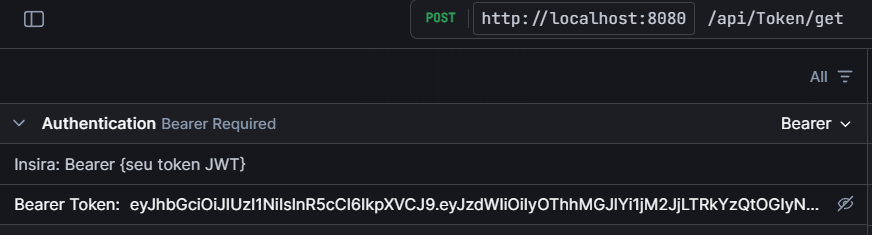

# Cashflow - Controle e Consolidação de Fluxo de Caixa

## 📋 Descrição

Este projeto é uma solução completa para controle de lançamentos de caixa (débitos e créditos) de um comerciante e geração de relatórios consolidados de saldo diário.  
A arquitetura foi projetada para ser **escalável, resiliente, segura e com alta disponibilidade**, utilizando C#, Docker, RabbitMQ, Redis e PostgreSQL.

---

## 🏗️ Arquitetura da Solução

A solução utiliza arquitetura de **microserviços** desacoplados via mensageria e cache:

- **Cashflow.Operations.Api**: API para lançamento de débitos/créditos
- **Cashflow.Consolidation.Worker**: Worker para consolidar e armazenar saldos diários a partir de eventos de lançamento
- **Cashflow.Reporting.Api**: API para consulta dos saldos diários consolidados
- **RabbitMQ**: Mensageria para desacoplar APIs e worker, garantir resiliência e processamento assíncrono
- **PostgreSQL**: Persistência dos lançamentos e saldos consolidados
- **Redis**: Cache de saldos para acelerar consultas no relatório diário

### **Principais características**

- **Escalabilidade**: cada componente pode ser escalado horizontalmente e de forma independente
- **Resiliência**: APIs e worker são independentes; falha em um componente não afeta o outro
- **Idempotência**: controle de chaves para evitar duplicidade de lançamentos
- **Testes de unidade e integração**: cobertura do fluxo principal

---

## 🔁 Fluxo da Aplicação

1. **Usuário faz um lançamento** (débito/crédito) na `Cashflow.Operations.Api`
2. O lançamento é persistido e publicado via RabbitMQ
3. O `Cashflow.Consolidation.Worker` consome o evento, atualiza o saldo consolidado no banco
4. O `Cashflow.Reporting.Api` permite consultar o saldo consolidado do dia, utilizando cache Redis para performance

---

## 🚀 Como Executar Localmente

### **Pré-requisitos**
- [Docker](https://www.docker.com/)
- [Docker Compose](https://docs.docker.com/compose/)
- [.NET 8 SDK](https://dotnet.microsoft.com/en-us/download/dotnet/8.0) (para desenvolvimento/local build)

### **1. Clone o repositório**

```bash
git clone https://github.com/seuusuario/cashflow.git
cd cashflow
```

### **2. Suba a infraestrutura (RabbitMQ, Redis, Postgres)**

```bash
docker compose build --no-cache
docker compose build up
```
A execução das apis e workers, pode demorar um tempo porque eles tem depends_on dos serviços como Redis, Rabbit e Postgress. Executando essa parte de cima, todos os projetos vão ser inicializados, só que pode demorar para aparecer.

> Isso irá subir:
> - PostgreSQL (padrão na porta 5432)
> - RabbitMQ (porta 5672 e painel em 15672, login padrão: guest/guest)
> - Redis (porta 6379)

### **3. Rode os serviços .NET (API, Worker, Reporting)**
> Você pode rodar os serviços via Docker Compose, ou localmente em cada pasta com:

```bash
# API de lançamentos
cd src/Cashflow.Operations.Api
dotnet run

http://localhost:8080/scalar/

# Worker de consolidação
cd src/Cashflow.Consolidation.Worker
dotnet run

# API de relatórios
cd src/Cashflow.Reporting.Api
dotnet run

http://localhost:8082/scalar/
```

Ou subir todos via Docker Compose (ajuste nomes conforme seus arquivos):

```bash
docker compose build --no-cache
docker compose up
```

---

## 🧪 Testes

Para rodar os testes automatizados:

```bash
dotnet test
```

Os testes cobrem:
- Casos de sucesso e falha nos lançamentos
- Processamento de eventos no Worker
- Consulta e cache no Reporting
- Existem começo dos teste de integração com TestContainer e estrura em PR. (Acompanha migrations)

---

## 📚 Documentação e Diagramas

- [docs/ARQUITETURA.md](docs/ARQUITETURA.md): Decisões arquiteturais, fluxos de dados e diagramas de componentes.
- [docs/diagramas/](docs/diagramas/): Diagramas de sequência, componentes, etc.
- Todos os endpoints e exemplos de uso estão documentados em cada projeto.

---

## 🛡️ Segurança

- O sistema foi preparado para fácil integração de autenticação/autorização (JWT ou OAuth2)
- Comunicação interna entre serviços pode ser protegida via TLS
- Chaves sensíveis são mantidas em variáveis de ambiente

---

## 🎯 Requisitos não-funcionais atendidos

- **Escalabilidade**: arquitetura modular, pode escalar APIs e Worker separadamente
- **Resiliência**: APIs e Worker são independentes; uso de mensageria desacopla componentes críticos
- **Performance**: uso de Redis para cache de saldos, consultas rápidas mesmo sob carga
- **Alta disponibilidade**: possível executar múltiplas instâncias de API/Worker

---

---

## Docs

Nessa pasta a desenhos e descrições mais detalhadas de algumas escolha e o que faltou

---

## Docs

Nessa pasta a desenhos e descrições mais detalhadas de algumas escolha e o que faltou

---

## 📖 Documentação da API

### Por que escolhi o Scalar?

Escolhi o **Scalar** para documentação da API em vez do Swagger pelos seguintes motivos:

- O suporte ao Swagger UI tradicional para .NET não está mais sendo mantido oficialmente, tornando o uso cada vez mais trabalhoso e dependente de soluções alternativas.
- O Scalar oferece uma experiência mais moderna, responsiva e amigável, além de suporte nativo ao OpenAPI, facilitando a manutenção da documentação das APIs.
- Com o Scalar, consigo customizar e integrar melhor com as ferramentas atuais de desenvolvimento.

Dessa forma, mantenho a documentação sempre atualizada, prática e alinhada com os padrões mais modernos de APIs REST.

---

### 🔐 Autenticação - Endpoint de Token

Implementei um endpoint de autenticação para obtenção de token, que será necessário para acessar as rotas protegidas das APIs.

Para obter o token de acesso, faça um POST para:

POST /api/auth/token


> **Observação:**  
> O endpoint de autenticação já está disponível, mas a implementação completa do fluxo de autorização/autenticação ainda está em evolução.

**Como usar:**
1. Realize a requisição de token no endpoint `/api/Token/get`
2. Use o token retornado no header `Bearer token` das suas requisições:



## 💡 Melhorias Futuras

- Implementar autenticação/autorização (JWT).
- Adicionar observabilidade (metrics, tracing, logging distribuído).
- Melhorar gestão de erros e retries no worker.
- Configurar readiness/liveness probes para Kubernetes.

---

## 💡 Observação

- Todo o histórico está registrado nos commits. Eu tive tempo mas consegui pegar o projeto a pouco tempo e gostaria de colocar um tempo limite para ver o que eu era capaz de fazer e o que não. E como documentar essa jornada.
- Isso foi muito divertido, e agradeço bastante pelo desafio. Qualquer coisa, só chamar
---


