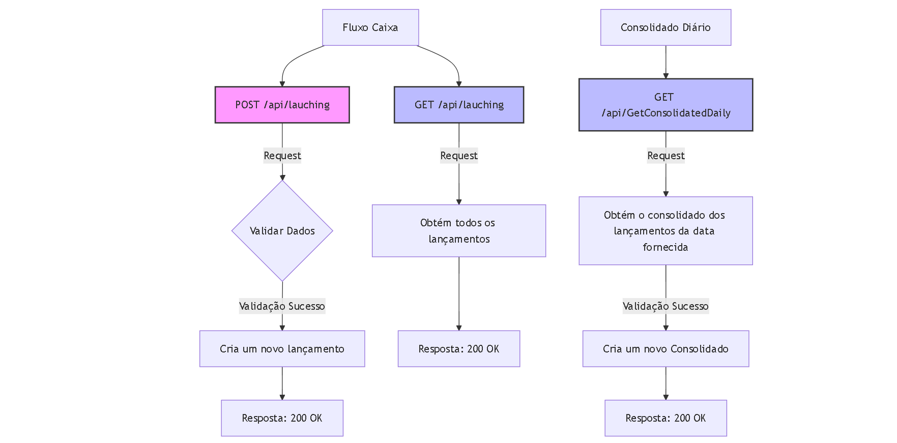

# FluxoCaixaAPI .NET Core 9 com DDD, MediatR e Repository 
Este é um projeto de exemplo de uma API criada com .NET Core 9 usando Domain-Driven Design (DDD), MediatR para gerenciamento de comandos e eventos, e um padrão de repositório para acesso a dados. A aplicação possui endpoints para criação e recuperação de lançamentos, além de um endpoint para obter o consolidado. O banco de dados utilizado é MySQL com Entity Framework Core (EF Core).

## Tecnologias Utilizadas

- .NET Core 9
- DDD (Domain-Driven Design)
- MediatR
- Repository Pattern
- MySQL
- EF Core (Entity Framework Core)
### FluxoGrama do Projeto

  
## Clonar o Repositório:
bash
git clone (https://github.com/Everton-Felix-Sales/Box-Flux-API.git)

## Configurar a String de Conexão com o MySQL: 
Atualize o arquivo appsettings.json com a string de conexão do MySQL:
EX:
"Default": "Server=localhost;Database=BoxFluxAPI;User=root;Password=seupassword;Port=3306;"

## Crie uma Migration para criar uma DB nova:
- dentro do Visual Studio , va em Ferramentas -> Gerenciador de pacotes NUGet-> Console do gerenciador de pacotes.
 
- Execute o Comando :
- Add-Migration Initial  ( inicia a Migration com arquivo Context existente )
- Update-Database ( Cria ou Atualiza o Banco de dados e tabelas dentro do arquivo Context )
 
## Selecione a Camada como projeto de incialização:
- Boxflux.Web

## Restaurar Dependências:
- dotnet restore
 
## Endpoints

### Lançamentos

#### POST /api/lauching

Cria um novo lançamento.

- **URL:** `/api/Lauching`
- **Método HTTP:** `POST`
- **Corpo da Requisição:**
  ```json
  {
    "type": "string", // "credito" ou "debito"
    "value": "decimal"
  }
### Resposta de Sucesso:

 Código: 200 OK

## GET /api/lauching
## Obtém todos os lançamentos.

URL: /api/Lauching

Método HTTP: GET

## Resposta de Sucesso:

 Código: 200 OK

- **Corpo da Requisição:**
  ```json
  {
    "type": "string", // "credito" ou "debito"
    "value": "decimal",
  "dateLauching": "datetime"
  }

## Consolidado
## GET /api/GetConsolidatedDaily
## Obtém o consolidado dos lançamentos.

URL: /api/GetConsolidatedDaily

Método HTTP: GET

Resposta de Sucesso:

Código: 200 OK

- **Corpo da Requisição:**
-  ```json
   {
   "Balance"
   }

 
## Contribuição
- Se desejar contribuir com este projeto, por favor, siga os passos abaixo:

## Fork o Repositório

- Crie um Branch para sua Funcionalidade (git checkout -b feature/nova-funcionalidade)

- Faça Commit das Suas Modificações (git commit -m 'Adiciona nova funcionalidade')

- Envie para o Branch (git push origin feature/nova-funcionalidade)

- Abra um Pull Request
