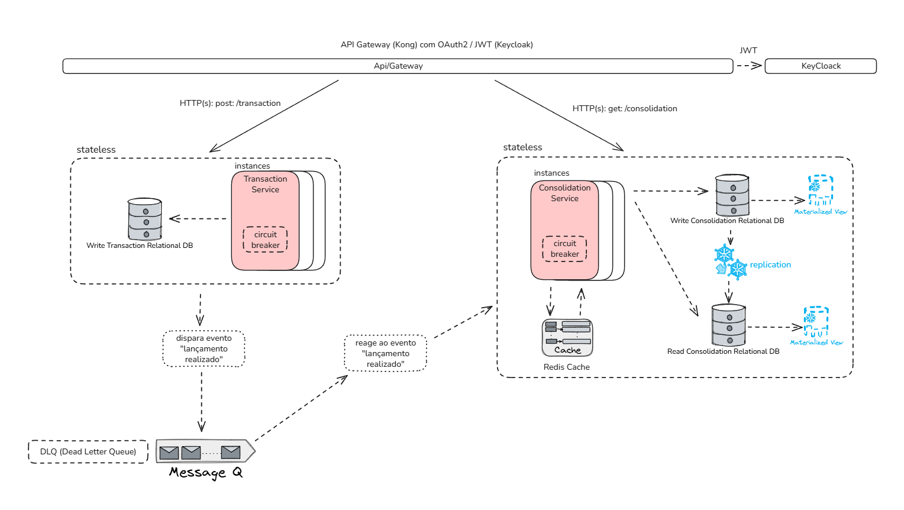

# Arquitetura Platform

## 1. Visão Geral

Esta solução implementa um sistema de controle financeiro com foco em **escalabilidade, segurança, manutenção e desacoplamento**, utilizando:

- **Microsserviços** (Lançamentos e Consolidação)
- **Clean Architecture** como padrão interno de cada serviço
- **Autenticação centralizada** via Keycloak (OAuth2/JWT)
- **API Gateway Kong** para roteamento e segurança
- **Mensageria assíncrona** com RabbitMQ
- **Orquestração e escalabilidade** com Docker Compose
- **Serviços Stateless**: todos os microsserviços são stateless, facilitando escalonamento horizontal e login.
- **Circuit Breaker** implementado nas chamadas síncronas entre serviços para garantir resiliência.
- **Views Materializadas** e **Read Replicas** utilizadas para otimizar e escalar consultas ao serviço de consolidação.
- **Padrão Mediator com MediatR**: desacoplamento dos fluxos de negócio, facilitando manutenção e testes.

---

## 2. Decisões Arquiteturais

### 2.1 Requisitos Não Funcionais Fundamentais

- **Resiliência entre serviços:**  
  O serviço de controle de lançamento **não deve ficar indisponível** se o sistema de consolidado diário cair, seja por falha ou sobrecarga.  
  > *Em dias de pico, o serviço de consolidação diária pode receber até 50 requisições por segundo, com tolerância máxima de 5% de perda.*

- **Escalabilidade e Simplicidade de Login:**  
  Todos os serviços são **stateless**:  
  - Não mantêm sessão local ou dados de contexto de usuário na memória.
  - O login é realizado via token JWT emitido pelo Keycloak e validado a cada requisição.
  - O escalonamento horizontal é facilitado, pois qualquer instância pode atender qualquer requisição sem dependência de afinidade de sessão (“sticky session”).

- **Resiliência reforçada com Circuit Breaker:**  
  Para chamadas síncronas entre serviços (como consultas diretas ao serviço de consolidação), é implementado o padrão **circuit breaker**.  
  - Isso garante que, caso o serviço de consolidação fique indisponível, os serviços consumidores não sejam impactados indefinidamente, podendo rapidamente retornar erro controlado, isolar falhas e recuperar assim que a consolidação voltar ao ar.

### 2.2 Escolhas e Justificativas

- **Mensageria assíncrona com RabbitMQ:**  
  Esta escolha foi direcionada principalmente para garantir que o serviço de controle de lançamento continue disponível e responsivo mesmo que o serviço de consolidação diária esteja indisponível ou com latência elevada.  
  - **Como funciona:**  
    - O serviço de lançamentos publica eventos no RabbitMQ logo após processar uma transação.
    - O serviço de consolidação diária consome esses eventos de forma assíncrona, processando-os quando estiver disponível.
    - Se o consolidador cair, as mensagens permanecem na fila até que o serviço retorne, evitando perda de dados e desacoplando a disponibilidade dos dois sistemas.
  - **Resultado:**  
    - O serviço de lançamentos nunca depende diretamente da disponibilidade do consolidador.
    - Em caso de sobrecarga (ex: 50 req/s), as mensagens são enfileiradas e processadas conforme o consolidador for capaz, respeitando o limite máximo de perda estabelecido pelo requisito (5%).

- **Escalabilidade e tolerância a falhas:**  
  - Como a consolidação diária pode ser instável ou sofrer picos, ela pode ser escalada horizontalmente (várias instâncias consumidoras).
  - A arquitetura admite perda controlada (até 5%) em condições extremas, podendo ser ajustada via políticas do RabbitMQ (ex: dead-letter, TTL, redrive).

- **Views Materializadas e Read Replicas para performance e escalabilidade de consulta:**  
  Para as consultas feitas diretamente ao serviço de consolidação (especialmente relatórios e agregações), são empregadas **views materializadas** no banco de dados, associadas a **read replicas**.  
  - **Views materializadas** aumentam consideravelmente a performance das consultas, reduzindo o tempo de resposta e o impacto de consultas complexas no banco operacional.
  - **Read replicas** distribuem a carga de leitura, permitindo que múltiplas instâncias de serviço de consolidação realizem consultas simultâneas sem degradar a performance do banco principal.
  - Essa abordagem garante que, mesmo em cenários de pico de acesso, a arquitetura suporta alta concorrência e mantém baixa latência, atendendo ao requisito de até 50 req/s e tolerância de perda.

- **Padrão Mediator com MediatR:**  
  - O padrão de projeto Mediator foi implementado utilizando a biblioteca [MediatR](https://github.com/jbogard/MediatR).
  - Todos os fluxos de negócio (Commands, Queries, Notifications) são desacoplados dos controllers, centralizados em handlers.
  - Isso facilita a manutenção, a testabilidade e a extensão das regras de negócio, permitindo aplicar comportamentos transversais (ex: validação, logging, cache) de forma centralizada.

---

### 2.3 Padrão de Projeto

- **Clean Architecture**:  
  - Separação clara de responsabilidades
  - Camadas: Domain, Application, Infrastructure, Presentation (API)
  - Facilita testes, manutenção e evolução dos serviços

- **Mediator (MediatR)**:  
  - Controllers disparam comandos/queries via IMediator.
  - Regras de negócio ficam centralizadas em handlers, promovendo baixo acoplamento.
  - Facilita a implementação de cross-cutting concerns e pipelines (ex: logging, validação, etc).

### 2.4 Microsserviços

- **Transaction Service**: expõe endpoints para registrar transações, publica eventos de lançamento no RabbitMQ.
- **Consolidation Service**: consome eventos do RabbitMQ, mantém o saldo diário consolidado, expõe endpoint para consulta.

Cada serviço tem seu próprio banco de dados, permitindo independência e resiliência.

### 2.5 Integração e Comunicação

- **RabbitMQ**:
  - Lançamentos publicam eventos após gravação.
  - Consolidação consome eventos, processa e atualiza relatórios.
  - Garante desacoplamento entre serviços e resiliência (mensagens não se perdem).

- **API Gateway Kong**:
  - Centraliza o acesso externo.
  - Enforce de autenticação e autorização.
  - Roteamento de APIs internas.

- **Keycloak**:
  - Servidor de identidade.
  - Geração e validação de tokens JWT.
  - Gerenciamento centralizado de usuários, roles, e políticas.

### 2.6 Orquestração e Escalabilidade

- **Docker Compose**:
  - Facilita o deploy, escala e isolamento de cada serviço.
  - Permite ambientes consistentes para desenvolvimento, testes e produção.
  - Cada componente roda em container dedicado (serviços, bancos, mensageria, gateway, auth).

- **Stateless Services**:
  - Todos os microsserviços foram implementados de forma stateless.
  - O login/autorização é feito via JWT e não há gerenciamento de sessão em memória.
  - Isso permite o aumento ou redução de instâncias conforme a demanda (escalonamento horizontal), sem preocupação com a continuidade de sessões.

- **Circuit Breaker**:
  - Implementado nas chamadas síncronas entre serviços para isolar falhas e garantir resiliência, atendendo ao requisito de disponibilidade mesmo em caso de queda do sistema de consolidação.

### 2.7 Banco de Dados

- Cada microsserviço possui seu próprio banco relacional.
- Evita acoplamento, facilita versionamento e segurança de dados.
- **Views Materializadas** são utilizadas no serviço de consolidação para acelerar relatórios e consultas de agregação.
- **Read Replicas** são configuradas para distribuir a carga das consultas de leitura, aumentando a escalabilidade e disponibilidade do sistema para grandes volumes de acesso.

### 2.8 Cache (Opcional)

- O serviço de Consolidação pode utilizar Redis para acelerar consultas de relatórios diários frequentemente acessados.

### 2.9 Segurança

- **JWT emitido pelo Keycloak**, validado pelo Kong antes de chegar aos microsserviços.
- Minimiza exposição de superfícies de ataque.
- Comunicação entre containers pode ser restrita à rede interna Docker.

---

## 3. Uso do padrão Mediator com MediatR

A solução adota o padrão de projeto **Mediator** utilizando a biblioteca [MediatR](https://github.com/jbogard/MediatR), recomendada para aplicações .NET modernas.

### Benefícios do uso de MediatR:

- **Desacoplamento:** Controllers não conhecem detalhes da lógica de negócio, apenas enviam comandos/queries ao Mediator.
- **Organização:** Fluxos de negócio ficam centralizados em handlers, facilitando manutenção e evolução.
- **Testabilidade:** Handlers são facilmente testáveis, sem necessidade de instanciar controllers ou infraestrutura web.
- **Extensibilidade:** Permite aplicar comportamentos (Behaviors) como logging, validação, cache e auditoria de forma transversal.
- **Consistência:** Define padrões claros entre comandos (Command), consultas (Query) e notificações (Notification).

### Como configurar o MediatR no .NET 8

No `Program.cs` do serviço:

```csharp
builder.Services.AddMediatR(cfg => cfg.RegisterServicesFromAssemblyContaining<MovementHandler>());
```

### Observação

- **Handlers** podem injetar repositórios, publishers, etc, normalmente definidos por interfaces, reforçando o uso de Clean Architecture.
- O padrão Mediator via MediatR é aplicado em todos os microsserviços para manter consistência arquitetural e facilitar a evolução da solução.

---

## 4. Diagrama de Arquitetura



---

## 5. Clean Architecture – Estrutura dos Serviços

### 5.1 Estrutura de Pastas

```
/Platform
  /Platform.Domain
    Entity/
    Enum/
    Repository/
    Validator/
    ValueObject/
  /Platform.Application
    Events/
    Templates/
    UseCases/
  /Platform.Infrastructure
    Data/
    Messaging/
    Security/
  /Platform.Api
    Configurations/
    Controllers/
    Filters/
    Program.cs
```

### 5.2 Camadas

- **Domain**:  
  Entidades, regras, interfaces de repositório/evento, casos de uso puros.
- **Application**:  
  Orquestra regras do domínio, processamento de DTOs, lógica de aplicação.
- **Infrastructure**:  
  Implementação de persistência (SQL), mensageria (RabbitMQ), autenticação, cache.
- **API**:  
  Endpoints REST, controllers, autenticação JWT.

---

## 6. Fluxos Principais

### 6.1 Lançamento

1. Usuário se autentica no Keycloak, obtém token JWT.
2. Requisição é feita via Kong, que valida o JWT.
3. Serviço de Lançamentos recebe, valida e grava a transação.
4. Serviço publica evento no RabbitMQ.

### 6.2 Consolidação

1. Serviço de Consolidação consome eventos do RabbitMQ.
2. Atualiza saldos e relatórios diários.
3. Exposição de endpoint para consulta, com cache opcional.
4. Consultas diretas utilizam views materializadas e read replicas para garantir alta performance e escalabilidade.

---

## 7. Como Executar

1. Instale Docker e Docker Compose.
2. Clone o repositório.
3. Execute:
   ```bash
   docker-compose up -d
   ```
4. Acesse:
   - http://localhost:8030/swagger ( documentação lançamentos )
   - http://localhost:8030/transaction
   - http://localhost:8031/swagger ( documentação consolidações )
   - http://localhost:8031/consolidations 
---

## 8. Referências de Arquivos

- `docker-compose.yml`: Orquestração completa dos serviços
- `docs/arquitetura.png`: Diagrama gerado
- `Transaction/`, `Consolidation/`: Implementação Clean Architecture dos serviços

---

## 9. Justificativas e Trade-offs

- **Clean Architecture**: maior complexidade inicial, porém facilita evolução e testes.
- **Microsserviços**: overhead de infraestrutura, mas garante escalabilidade e isolamento de falhas.
- **Mensageria**: resiliência e desacoplamento, introduz latência eventual, mas atende plenamente o requisito de resiliência entre lançamentos e consolidação, e tolera picos e falhas temporárias.
- **Serviços Stateless**: facilitam o login (tudo via JWT, sem afunilamento de state/sessão), permitem escalabilidade real e alternância de instâncias sem impacto para o usuário.
- **Circuit Breaker**: protege consumidores contra falhas prolongadas, permitindo fallback e rápida recuperação sem degradar todo o sistema.
- **Views Materializadas e Read Replicas**: aumentam a velocidade das consultas agregadas e a escalabilidade, essenciais para relatórios e dashboards, sem penalizar o banco operacional.
- **Gateway/API Auth**: segurança centralizada, mas exige configuração adicional.
- **Docker Compose**: fácil de subir e escalar, limitações de produção comparado ao Kubernetes, mas excelente para MVP e provas de conceito.

---

## 10. Considerações Finais

A arquitetura escolhida atende aos requisitos de escalabilidade, segurança, desacoplamento e facilidade de manutenção, sendo adequada tanto para MVPs quanto para evolução futura do produto.  
A escolha por mensageria assíncrona garante que o serviço de lançamentos permaneça disponível mesmo diante de falhas ou sobrecarga no serviço de consolidação, atendendo ao requisito de resiliência e tolerância a picos de uso com perda controlada de requisições.  
Além disso, a implementação stateless de todos os serviços garante escalabilidade horizontal e simplifica a experiência de login dos usuários.  
O uso de **circuit breaker** reforça a resiliência nas integrações síncronas, e o emprego de **views materializadas** associadas a **read replicas** aumenta a performance e escalabilidade em consultas críticas do sistema de consolidação.

## 11. Bibliotecas de Testes Utilizadas

A solução utiliza as seguintes bibliotecas para testes automatizados e validação:

- **[Bogus](https://github.com/bchavez/Bogus)**: geração de dados fake para testes (`34.0.2`)
- **[FluentAssertions](https://fluentassertions.com/)**: asserções legíveis e poderosas nos testes (`6.7.0`)
- **[FluentValidation](https://docs.fluentvalidation.net/en/latest/)**: validação fluente de objetos e regras de negócio (`11.2.2`)
- **[Moq](https://github.com/moq/moq4)**: criação de mocks para dependências em testes unitários (`4.18.1`)

Exemplo de referência no projeto de testes:

```xml
<ItemGroup>
  <PackageReference Include="Bogus" Version="34.0.2" />
  <PackageReference Include="FluentAssertions" Version="6.7.0" />
  <PackageReference Include="FluentValidation" Version="11.2.2" />
  <PackageReference Include="Moq" Version="4.18.1" />
</ItemGroup>
```

Essas bibliotecas auxiliam na qualidade, legibilidade e confiabilidade dos testes automatizados dos microsserviços.
