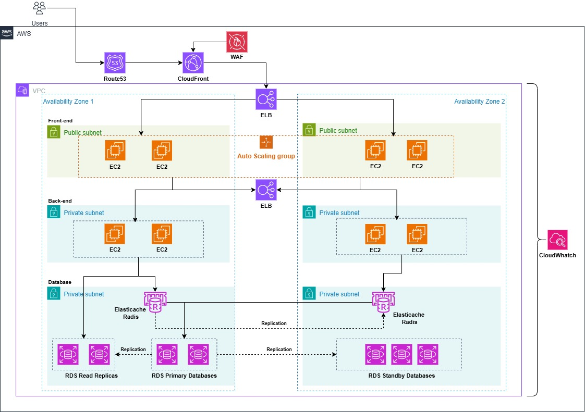

# Cash-Flow-Control

Project to control releases (debits/credits) and provide daily consolidation of balances.

## Visão Geral

 **Serviço de Lançamentos** (Transactions Service) — responsável por receber, validar e persistir lançamentos financeiros.

---

## Tecnologias sugeridas
- Linguagem: **C# (.NET 8+)**
- ORM: **EF Core** (migrations)
- Banco de dados: **PostgreSQL** (produção), **SQLite/InMemory** (testes locais)
- Resiliência: **Polly** (circuit breaker, retry, bulkhead)
- Logging: **Serilog**
- Testes: **xUnit** + **Moq** para unit tests; **Microsoft.AspNetCore.Mvc.Testing** para integration tests
- Container: **Docker / Docker Compose**
- Observability: health checks e métricas (Prometheus)

---

## Arquitetura (resumo)
- API REST do Serviço de Lançamentos expõe endpoints para CRUD de lançamentos.
- Serviço de Consolidado consome eventos e atualiza a tabela `DailyBalance` (ou recalcula sob demanda).
- Caso o consolidado fique offline, as mensagens ficam no broker (durability) e serão processadas quando voltar.
- Ambos serviços são stateless e podem escalar horizontalmente.

---



## Modelo de Dados (simplificado)

```csharp
public enum TransactionType { Credito = 1, Debito = 2 }

public class Transaction
{
    public Guid Id { get; set; }
    public DateTime OccurredAt { get; set; } // UTC
    public decimal Amount { get; set; }
    public TransactionType Type { get; set; }
    public string Description { get; set; }
}

public class DailyBalance
{
    public DateTime Date { get; set; } // date only (UTC)
    public decimal OpeningBalance { get; set; }
    public decimal TotalCredits { get; set; }
    public decimal TotalDebits { get; set; }
    public decimal ClosingBalance { get; set; }
}
```
---

## Endpoints (exemplos)

### Serviço de Lançamentos
  ```
   > Porta 5000
  ```
- `POST /api/transactions` — cria um lançamento.
  - Body: `{ "occurredAt": "2025-08-30", "amount": 150.00, "type": "Credito", "description": "Venda A" }`
  - Resposta: `201 Created` com recurso criado.

- `GET /api/transactions?date=2025-08-30` — lista lançamentos do dia.

- `GET /api/transactions` — lista de todos os lançamentos

### Serviço de Consolidado
  ```
   > Porta 5005
  ```

- `GET /api/daily/{yyyy-MM-dd}` — retorna `DailyBalance` do dia.
- `POST /api/daily/{yyyy-MM-dd}/recompute` — força recomputo do consolidado (útil em correções).
  - Body: `[{"amount": 250.00,"type": "Credito"},{"amount": 453.00, "type": "Credito"}]`

- `GET /health` — health-check

---

## Requisitos Não-Funcionais (como atender)

- **Taxa de 50 req/s no consolidado com ≤5% perda:**
  - Escalar horizontalmente o serviço de consolidado por meio de contêineres (Kubernetes/Autoscaling).
  - Consumir eventos em lote e aplicar agregações em memória antes de persistir (reduz I/O).
  - Usar um cache (Redis) para respostas frequentes do consolidado.
  - Implementar políticas de retry e backoff com Polly; em casos de pico, permitir até 5% de rejeição mediante políticas de fallback (circuit breaker + 429/503 ao cliente) registradas.

---

## Boas práticas e padrões aplicados

- **CQRS** separar comandos (escrita — lançamentos) de consultas (leitura — consolidado) para otimizar cada caminho.
- **Repository + UnitOfWork** com **EF Core** para abstrair persistência.
- **Mediator pattern** (MediatR) para orquestrar handlers de comando/evento.
- **Domain Events**: publicar eventos quando transações são criadas.
- **SOLID**: serviços pequenos e testáveis, injeção de dependência.
- **Circuit Breaker / Bulkhead / Retry** com Polly.
- **Immutable events** e versionamento de eventos para compatibilidade futura.

---

## Como rodar localmente (exemplo com Docker Compose)

1. Requisitos: Docker, dotnet SDK

2. Arquivo `docker-compose.yml` básico (Postgres):

```yaml
version: '3.8'
services:
  postgres:
    image: postgres:15
    environment:
      POSTGRES_USER: app
      POSTGRES_PASSWORD: secret
      POSTGRES_DB: cashflow
    ports:
      - "5432:5432"
    volumes:
      - pgdata:/var/lib/postgresql/data
  
volumes:
  pgdata:
```

3. Rodar:

```bash
docker compose up -d
cd src/TransactionsService
dotnet restore
dotnet ef database update
dotnet run

```
> Faça o mesmo para `DailySummaryService`.

---

## Estrutura sugerida de projeto

```
/src
  /TransactionsService
    /Controllers
    /Domain
    /Infrastructure
    /Application
    Program.cs
  /DailySummaryService
    /Controllers
    /Domain
    /Infrastructure
    /Application
    Program.cs
/tests
  /TransactionsService.UnitTests
  /DailySummaryService.UnitTests
```

---

## Exemplo rápido: Controller de Transações (esqueleto)

```csharp
[ApiController]
[Route("api/[controller]")]
public class TransactionsController : ControllerBase
{
    private readonly ITransactionService _service;

    public TransactionsController(ITransactionService service)
    {
        _service = service;
    }

    [HttpPost]
    public async Task<IActionResult> Create([FromBody] CreateTransactionDto dto)
    {
        var id = await _service.CreateAsync(dto);
        return CreatedAtAction(nameof(GetById), new { id }, null);
    }

    [HttpGet("{id}")]
    public async Task<IActionResult> GetById(Guid id)
    {
        var t = await _service.GetByIdAsync(id);
        if (t == null) return NotFound();
        return Ok(t);
    }
}
```

---

## Testes

- Unit tests cobrindo serviços e validações (xUnit + Moq).
- Integration tests usando `WebApplicationFactory<TEntryPoint>` (Microsoft.AspNetCore.Mvc.Testing) com um banco em memória (SQLite in-memory) para verificar fluxo de criação e publicação de evento.


---

## 📊 Load Test com NBomber 6 (Teste de Carga)

Este projeto utiliza o [NBomber v6](https://nbomber.com/) para realizar **testes de carga** no serviço `DailySummaryService`.

---

## 🚀 Como rodar

### 1. Instalar o pacote
No diretório do projeto de testes, execute:

```bash
dotnet add package NBomber --version 6.*
```

### 2. Estrutura do teste
Exemplo de `Program.cs` já configurado:

```csharp
using NBomber.CSharp;
using System.Net.Http;

class Program
{
    static void Main(string[] args)
    {
        using var httpClient = new HttpClient { BaseAddress = new Uri("http://localhost:5005") };

        var scenario = Scenario.Create("get_daily_balance", async context =>
        {
            var date = DateTime.UtcNow.Date.ToString("yyyy-MM-dd");
            var response = await httpClient.GetAsync($"/api/daily/{date}");

            return response.IsSuccessStatusCode
                ? Response.Ok(payload: $"StatusCode: {(int)response.StatusCode}")
                : Response.Fail(payload: $"HTTP {(int)response.StatusCode}");
        })
        .WithLoadSimulations(
            Simulation.Inject(rate: 50, interval: TimeSpan.FromSeconds(1), during: TimeSpan.FromSeconds(30))
        );

        NBomberRunner
            .RegisterScenarios(scenario)
            .Run();
    }
}
```

---

### 3. Executar o teste

Compile e rode:

```bash
cd src/DailySummaryService.LoadTests
dotnet run
```

---

### 4. Saída dos resultados

O NBomber gera relatórios automaticamente em:

```
bin/Debug/net8.0/reports/
```

Você encontrará arquivos em **JSON** e **HTML**, por exemplo:

```
bin/Debug/net8.0/reports/index.html
```

Abra esse arquivo no navegador para visualizar os gráficos.

---

### 5. Personalizando o cenário

- Alterar a taxa de requisições (RPS):

```csharp
Simulation.Inject(rate: 100, interval: TimeSpan.FromSeconds(1), during: TimeSpan.FromMinutes(2))
```

- Alterar o endpoint alvo (`http://localhost:5005/api/daily/{date}`) para outro do seu serviço.

---

## ✅ Checklist

1. Suba o serviço `DailySummaryService` na porta **5005**:
   ```bash
   dotnet run --project src/DailySummaryService --urls "http://localhost:5005"
   ```

2. Rode o **load test**:
   ```bash
   dotnet run --project src/DailySummaryService.LoadTests
   ```

3. Veja os relatórios em:
   ```
   bin/Debug/net8.0/reports/index.html
   ```
---
