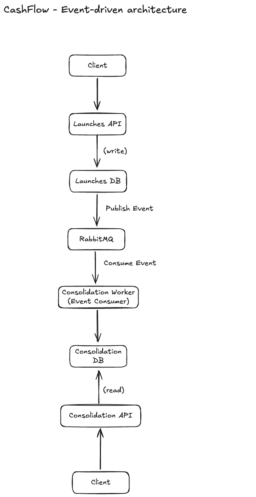

# CashFlow

O CashFlow resolve um problema comum em sistemas financeiros: registrar lançamentos de forma confiável e transformar esses dados em um saldo diário consistente para consulta.

A ideia principal da solução foi separar claramente duas responsabilidades: quem registra o fato (`Launches`) e quem consolida os efeitos (`Consolidation`). Essa separação permite manter o fluxo de escrita simples e rápido, enquanto a consolidação pode evoluir de forma independente, sem impactar a disponibilidade do sistema.

---

## Arquitetura

A solução segue uma abordagem de Clean Architecture enxuta, organizada em `Domain`, `Application`, `Infrastructure` e camadas de entrada (`Api` e `Worker`).

A divisão entre `Launches` e `Consolidation` foi uma decisão intencional para desacoplar responsabilidades. O contexto de lançamentos é responsável apenas por registrar os dados, enquanto o contexto de consolidação cuida exclusivamente do cálculo do saldo diário.

A comunicação entre esses contextos acontece de forma assíncrona, via RabbitMQ. Essa escolha foi feita para garantir que o registro de lançamentos não dependa do tempo de processamento da consolidação. Na prática, isso significa que o sistema continua aceitando novos lançamentos mesmo que o consolidado esteja indisponível naquele momento.

### Visão geral

Abaixo está uma visão simplificada de como os componentes se relacionam:



O diagrama pode ser acessado aqui:
https://excalidraw.com/#json=EnPy9DJka7P-8s1m0OXOE,2XvFxGJPKGSdfZ5M63AH5w

---

## Fluxo da aplicação

O fluxo principal acontece da seguinte forma:

1. `Launches.Api` recebe um `POST /api/launches`
2. O lançamento é validado e persistido no banco SQLite
3. Após o `SaveChangesAsync`, é publicado um `LaunchRegisteredIntegrationEvent` no RabbitMQ
4. O `Consolidation.Worker` consome esse evento
5. O worker dispara `ProcessLaunchRegisteredEventCommand` via MediatR
6. O `Consolidation` atualiza o `DailyConsolidation`
7. A idempotência garante que o mesmo lançamento não seja processado mais de uma vez

---

## Estrutura do projeto

* `CashFlow.BuildingBlocks`
* `CashFlow.Launches.Api`
* `CashFlow.Launches.Application`
* `CashFlow.Launches.Domain`
* `CashFlow.Launches.Infrastructure`
* `CashFlow.Consolidation.Api`
* `CashFlow.Consolidation.Worker`
* `CashFlow.Consolidation.Application`
* `CashFlow.Consolidation.Domain`
* `CashFlow.Consolidation.Infrastructure`

---

## Stack utilizada

* .NET 10
* MediatR
* EF Core + SQLite
* RabbitMQ
* FluentValidation
* xUnit
* FluentAssertions
* NSubstitute
* Minimal API
* Worker Service

---

## Subir dependências locais

```bash
docker compose up -d
```

Para derrubar:

```bash
docker compose down
```

RabbitMQ (interface de gerenciamento):

* URL: http://localhost:15672
* usuário: `cashflow`
* senha: `cashflow`

---

## Rodar aplicações

### Launches API

```bash
dotnet run --project src/Launches/CashFlow.Launches.Api --launch-profile http
```

* Base URL: http://localhost:5000

Rotas:

* `GET /health`
* `POST /api/launches`

---

### Consolidation API

```bash
dotnet run --project src/Consolidation/CashFlow.Consolidation.Api --launch-profile http
```

* Base URL: http://localhost:5001

Rotas:

* `GET /health`
* `GET /api/consolidations/{date}`
* `GET /api/consolidations?startDate=yyyy-MM-dd&endDate=yyyy-MM-dd`

---

### Consolidation Worker

```bash
dotnet run --project src/Consolidation/CashFlow.Consolidation.Worker
```

---

## Testes

```bash
dotnet restore
dotnet build
dotnet test
```

---

## Teste manual

Criar um lançamento:

```http
POST http://localhost:5000/api/launches
Content-Type: application/json

{
  "amount": 120.00,
  "type": "credit",
  "occurredOnUtc": "2026-04-26T13:00:00Z"
}
```

Consultar consolidado:

```http
GET http://localhost:5001/api/consolidations/2026-04-26
```

---

## Persistência de dados

Para simplificar a execução local e manter o foco no fluxo do desafio, foi utilizado SQLite como banco relacional em ambos os contextos.

Apesar disso, a separação entre `Launches` e `Consolidation` permite evoluir o modelo de dados de forma independente. Em um cenário produtivo, o contexto de leitura poderia utilizar uma estratégia diferente, como um banco otimizado para consultas, sem impactar o fluxo de escrita.

Essa flexibilidade vem diretamente da separação entre os contextos e do uso de comunicação assíncrona.

---

## Considerações sobre requisitos não funcionais

A arquitetura foi pensada para garantir que o serviço de lançamentos continue disponível mesmo em cenários de falha do consolidado.

Como a comunicação acontece via RabbitMQ, o `Launches` não depende da disponibilidade do `Consolidation` para confirmar a escrita. Caso o consumidor esteja indisponível, os eventos permanecem na fila até serem processados.

Para cenários de maior volume, a solução permite evoluir com estratégias como escalabilidade horizontal da API de leitura, uso de cache e otimizações no banco de dados, sem impactar o fluxo principal de escrita.

---

## Segurança (considerações)

Para manter o foco no desafio, não foi implementado controle de autenticação e autorização.

Em um cenário real, a solução poderia ser estendida com uso de JWT, controle de acesso por escopo e proteção dos endpoints, além de práticas como uso obrigatório de HTTPS e validação mais rigorosa das entradas.

---

## Confiabilidade e evolução

O desenho atual já melhora a consistência ao publicar eventos apenas após a persistência do lançamento. Isso reduz inconsistências e garante que o dado principal esteja salvo antes de qualquer integração.

Ainda assim, existe uma janela entre o commit no banco e a publicação no broker em caso de falha de infraestrutura. A evolução natural para esse cenário é a adoção do Outbox Pattern (detalhado em `docs/architecture.md`), que elimina essa lacuna sem alterar o modelo atual.

---

Essa solução foi pensada para ser simples de evoluir, permitindo que novos requisitos sejam incorporados sem comprometer o fluxo principal de lançamentos, mantendo o sistema estável mesmo em cenários de falha parcial.

---

## Observabilidade

A solução inclui pontos básicos de observabilidade por meio de logs estruturados, permitindo acompanhar o fluxo de eventos entre os serviços e identificar possíveis falhas no processamento.

Em um cenário produtivo, essa base poderia ser expandida com ferramentas de monitoramento e tracing distribuído, permitindo acompanhar o caminho completo de uma requisição (desde o registro do lançamento até a atualização do consolidado), além de facilitar a identificação de gargalos e falhas em sistemas assíncronos.