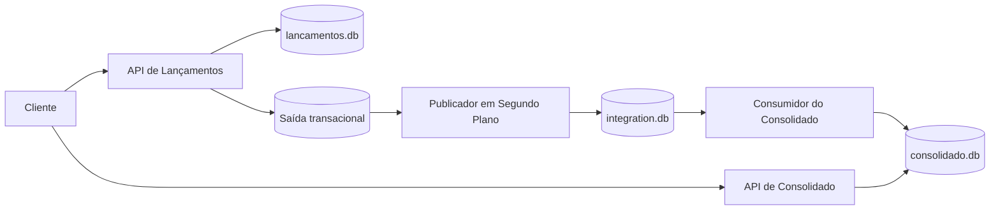

# Desafio Técnico - Arquitetura de Software

Implementação em C# de um sistema de fluxo de caixa diário com dois serviços independentes:

- `CashFlow.Lancamentos.Api`: registra débitos e créditos.
- `CashFlow.Consolidado.Api`: mantém e expõe o saldo diário consolidado.

O objetivo da solução é atender ao requisito central do desafio: o serviço de lançamentos continua operando mesmo que o consolidado esteja indisponível. Para isso, a comunicação entre os serviços é assíncrona, com persistência local durável e publicação desacoplada do processamento do consolidado.

## Visão rápida da solução



## Padrões adotados

- Separação de responsabilidades entre aplicação, domínio e infraestrutura.
- Saída transacional para gravar lançamento e evento de integração na mesma transação.
- Projeção materializada para leitura rápida do saldo diário.
- Idempotência para evitar duplicidade financeira em reenvios.
- Processamento assíncrono em segundo plano para desacoplar gravação e consolidação.

## Estrutura do repositório

```text
arquitetura software/
  CashFlow.sln
  README.md
  requisicoes.http
  docs/
  data/
  src/
    CashFlow.Shared/
    CashFlow.Lancamentos.Api/
    CashFlow.Consolidado.Api/
  tests/
    CashFlow.Tests/
```

## Requisitos atendidos

- Dois serviços separados para lançamentos e consolidado.
- Implementação em `C#`.
- Testes automatizados cobrindo regras críticas.
- Boas práticas com separação por camadas, idempotência, saída transacional e projeção materializada.
- README com instruções de funcionamento e execução local.
- Documentação complementar em `docs/`.

## Tecnologias

- `.NET 8`
- `ASP.NET Core Minimal API`
- `SQLite`
- `xUnit`

## Documentação complementar

- `docs/arquitetura-da-implementacao.md`
- `docs/decisoes-arquiteturais.md`
- `docs/revisao-banca-tecnica.md`
- `requisicoes.http`

## Como executar localmente

### Pré-requisito

Ter o `.NET 8 SDK` instalado.

### Subir o serviço de lançamentos

```bash
dotnet run --project src/CashFlow.Lancamentos.Api/CashFlow.Lancamentos.Api.csproj
```

Por padrão ele sobe em `http://localhost:5081`.

### Subir o serviço de consolidado

Em outro terminal:

```bash
dotnet run --project src/CashFlow.Consolidado.Api/CashFlow.Consolidado.Api.csproj
```

Por padrão ele sobe em `http://localhost:5082`.

### Rodar testes

```bash
dotnet test CashFlow.sln
```

## Fluxo principal

1. O cliente envia `POST /v1/lancamentos` com o cabeçalho `Chave-Idempotencia`.
2. O serviço de lançamentos valida o payload.
3. O lançamento é gravado na estrutura principal da razão imutável.
4. O evento de integração é gravado na estrutura de saída transacional na mesma transação.
5. Um processo em segundo plano publica o evento em `integration.db`.
6. O serviço de consolidado consome os eventos pendentes.
7. A projeção em `consolidado.db` é atualizada.
8. `GET /v1/consolidado/diario` responde com baixa latência.

## Endpoints

### API de lançamentos

- `POST /v1/lancamentos`
- `GET /v1/lancamentos?comercianteId=lojista-01&dataNegocio=2026-04-16`
- `GET /saude`

Exemplo de criação:

```bash
curl -X POST "http://localhost:5081/v1/lancamentos" ^
  -H "Content-Type: application/json" ^
  -H "Chave-Idempotencia: 8f6d08fb-0d53-48a0-8e64-6db4f3a43c19" ^
  -d "{\"comercianteId\":\"lojista-01\",\"dataNegocio\":\"2026-04-16\",\"tipo\":\"Credito\",\"valor\":120.50,\"descricao\":\"Venda no PDV\",\"origem\":\"PDV\"}"
```

### API de consolidado

- `GET /v1/consolidado/diario?comercianteId=lojista-01&dataNegocio=2026-04-16`
- `POST /v1/consolidado/diario/reprocessamentos`
- `GET /saude`

Exemplo de consulta:

```bash
curl "http://localhost:5082/v1/consolidado/diario?comercianteId=lojista-01&dataNegocio=2026-04-16"
```

Exemplo de reprocessamento:

```bash
curl -X POST "http://localhost:5082/v1/consolidado/diario/reprocessamentos" ^
  -H "Content-Type: application/json" ^
  -d "{\"comercianteId\":\"lojista-01\",\"dataNegocio\":\"2026-04-16\"}"
```

## Banco local

Os bancos SQLite são criados automaticamente na pasta `data/`:

- `lancamentos.db`
- `integration.db`
- `consolidado.db`

Essa abordagem foi escolhida para manter a solução simples de executar localmente. Em produção, o desenho natural seria substituir:

- `SQLite` transacional por `PostgreSQL` ou `SQL Server`;
- a fila local por `RabbitMQ`, `Kafka`, `Azure Service Bus` ou `AWS SQS`;
- a projeção local por um banco otimizado para leitura, com observabilidade e alta disponibilidade adequadas.

## Estratégia de testes

Os testes focam nas regras mais importantes do domínio e da integração assíncrona:

- criação de lançamento;
- reenvio idempotente;
- conflito de chave de idempotência com payload diferente;
- projeção do saldo diário;
- reprocessamento do consolidado.

## Cenários não funcionais atendidos

- O serviço de lançamentos não depende do serviço de consolidado para aceitar novas gravações.
- O consolidado lê de uma fila durável, então mensagens acumuladas podem ser processadas depois.
- A leitura do saldo diário ocorre sobre projeção materializada.
- Requisições repetidas não geram duplicidade financeira.

## Evoluções naturais

- autenticação e autorização com JWT e escopos;
- OpenTelemetry e métricas operacionais;
- tentativas automáticas com política de retentativa e fila de exceção;
- containerização com Docker Compose;
- troca do barramento local por infraestrutura real de mensageria;
- testes de integração com banco efêmero;
- documentação OpenAPI gerada em tempo de execução.

## Validação executada

Validações realizadas nesta entrega:

- `dotnet build CashFlow.sln --no-restore -m:1`
- `dotnet test CashFlow.sln --no-build -m:1`

Resultado:

- build da solução com sucesso;
- `6` testes aprovados.
