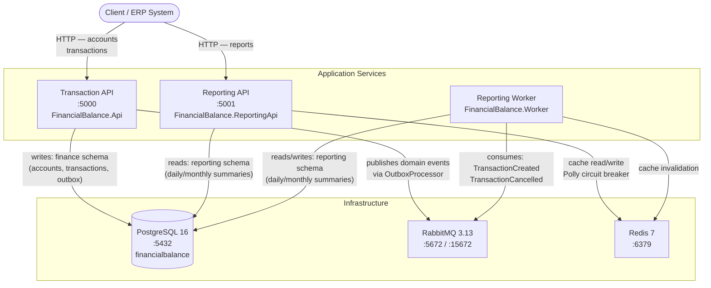
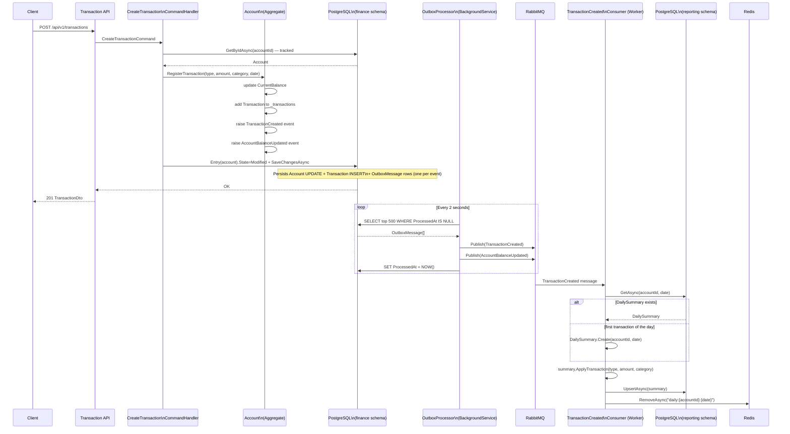
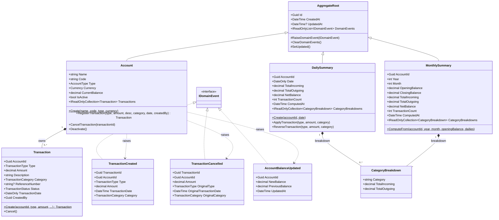
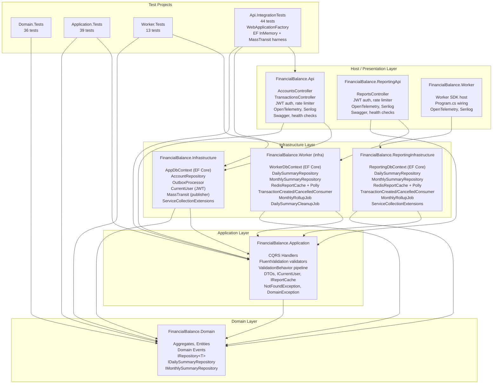
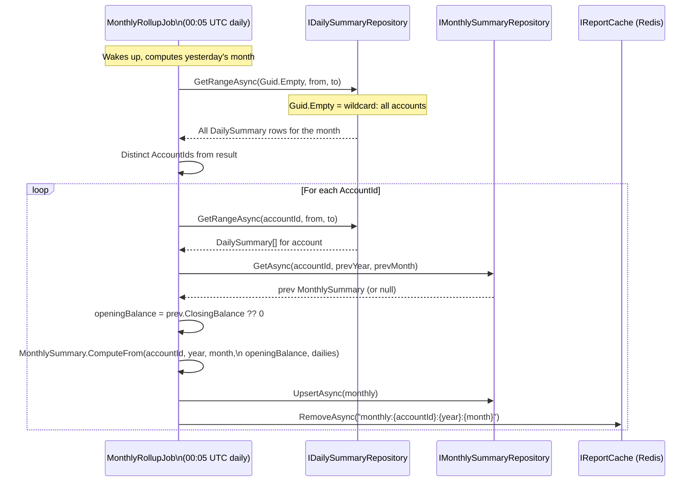
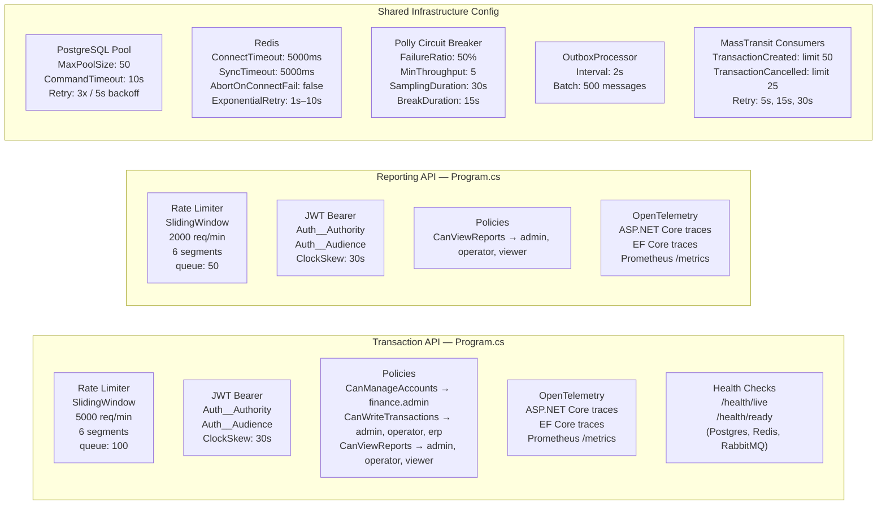

# Architecture Diagrams

---

## 1. System Context — Services and Infrastructure

High-level view of all running processes and how they connect to shared infrastructure.

---

## 2. Transaction Write Flow — Command to Event

Detailed sequence from an incoming HTTP request through the domain, outbox, and message broker to the read-model projection.

---

## 3. Domain Model — Classes and Relationships

Class structure of the domain layer including aggregates, entities, value objects, events, and interfaces.

---

## 4. Layered Architecture — Project Dependencies

Clean Architecture dependency flow across all projects in the solution.

---

## 5. Reporting Pipeline — Nightly Rollup

How daily summaries are rolled up into monthly summaries by the background job.

---

## 6. Infrastructure Configuration Summary

Key configuration values wired at startup across all three services.

