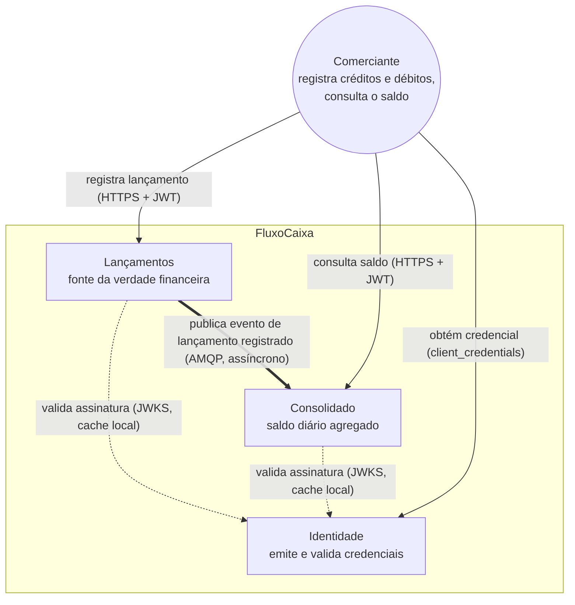
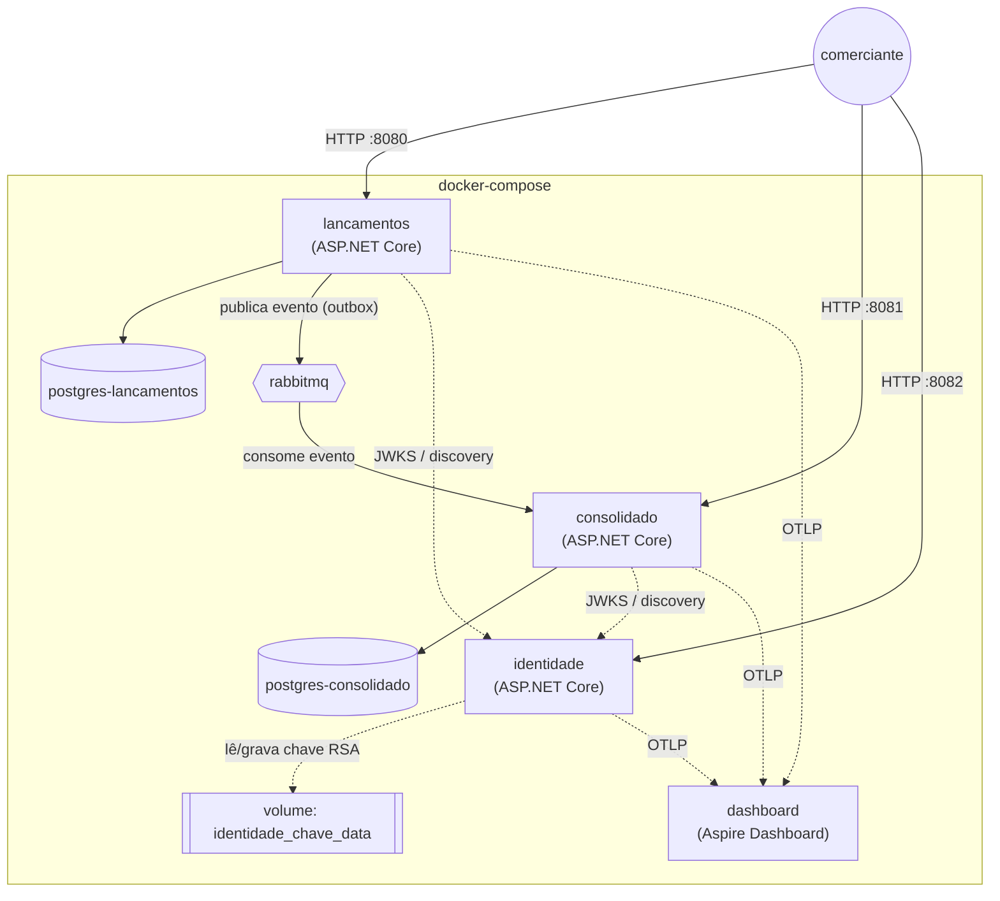
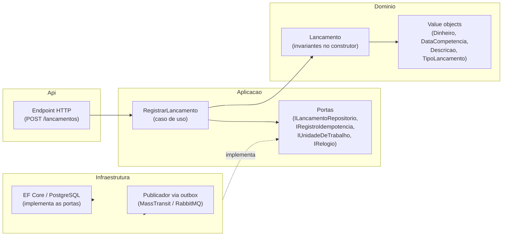
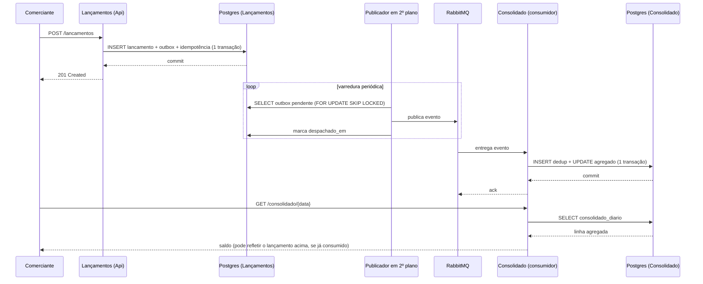

# FluxoCaixa — Lançamentos, Consolidado e Identidade

Três serviços independentes. **Lançamentos** registra créditos e débitos do caixa de um
comerciante: é a fonte da verdade financeira do sistema, o histórico é imutável, e nenhuma outra
operação além do registro é exposta (não há leitura, alteração, exclusão nem estorno).
**Consolidado** consome o evento publicado pelo Lançamentos e expõe o saldo diário resultante —
total de créditos, total de débitos e saldo líquido de uma data. **Identidade** é o emissor de
credenciais: autentica o comerciante por `client_credentials` e assina a credencial que os outros
dois validam.

O desenho é governado por uma assimetria deliberada: **registrar é crítico, consultar é
degradável**. O Lançamentos confirma o registro sem depender do transporte de mensagens
(RabbitMQ) nem de qualquer consumidor a jusante — a propagação do evento acontece fora do caminho
da requisição, via padrão outbox transacional. O Consolidado, do outro lado dessa mesma
assimetria, admite consistência eventual, uma defasagem de poucos segundos e disponibilidade
menor: sua indisponibilidade nunca afeta o registro.

## Diagramas

Mermaid, em blocos de código dentro deste Markdown: renderiza sozinho nas superfícies onde o
repositório costuma ser lido (GitHub, GitLab, editores com suporte), e permanece legível como texto
simples onde não renderiza — inclusive por quem nunca instalou uma ferramenta de diagramação.

### Contexto

Os três serviços, o comerciante que os usa, e as dependências externas de cada um.



### Contêineres

Como os componentes sobem no `docker-compose`: os três serviços, uma instância de PostgreSQL por
serviço de negócio, o RabbitMQ como transporte e o Aspire Dashboard como destino da telemetria.



### Componentes do Lançamentos

Direção da dependência entre as camadas — sempre para dentro, em direção ao domínio.



Só `Aplicacao` e `Dominio` são referenciados por `Api` e por `Infraestrutura`; nenhuma seta cruza no
sentido contrário — `Dominio` não conhece `Aplicacao`, nem `Aplicacao` conhece `Infraestrutura`.

### Fluxo de dados: do registro ao reflexo no consolidado

Do ponto de vista de uma requisição de registro, atravessando o outbox e a fila até aparecer na
consulta do saldo.



A confirmação ao comerciante (passo 4) acontece antes de qualquer publicação — é o que torna o
registro independente do transporte e da fila (ver
[decisão 001](documentacao/decisoes/001-outbox-transacional-e-assimetria-de-disponibilidade.md)).

## Arquitetura

**Lançamentos** — Clean Architecture / Hexagonal, com quatro projetos na raiz da solução,
dependência sempre apontando para dentro:

```
Api ──────────▶ Aplicacao ──────────▶ Dominio
 │                  ▲                    ▲
 └──▶ Infraestrutura ┘────────────────────┘
      (implementa as portas declaradas em Aplicacao)
```

- **Dominio** — entidade `Lancamento` com invariantes no construtor e value objects (`Dinheiro`,
  `DataCompetencia`, `Descricao`, `TipoLancamento`, `ComercianteId`). Sem dependência externa.
- **Aplicacao** — caso de uso `RegistrarLancamento` e as portas que a infraestrutura implementa.
- **Infraestrutura** — persistência em PostgreSQL via EF Core, publicação via MassTransit sobre
  RabbitMQ com outbox transacional, expurgo em segundo plano.
- **Api** — endpoint HTTP mínimo, autenticação, tradução de erro de domínio para Problem Details
  (RFC 9457).

**Consolidado** — projeto único (`FluxoCaixa.Consolidado.Api`), sem estratificação em camadas: não
há domínio a proteger, a operação é uma soma agregada.

```
FluxoCaixa.Consolidado.Api
├── Consulta/          endpoint + DTO de resposta
├── Consumo/           consumidor do evento
├── Persistencia/      DbContext, entidades, migrações
└── Program.cs         composição, autenticação
```

**Identidade** — projeto único (`FluxoCaixa.Identidade.Api`), sem banco: o emissor de credenciais,
com o par de chaves RSA gerado na primeira inicialização e persistido em volume nomeado.

```
FluxoCaixa.Identidade.Api
├── Chave/             carga/geração da chave RSA, derivação do kid
├── Emissao/           POST /connect/token (client_credentials)
├── Descoberta/        GET /.well-known/{jwks.json,openid-configuration}
└── Program.cs         composição
```

O contrato do evento (`EventoLancamentoRegistrado`) vive em `FluxoCaixa.Contratos`, um projeto
compartilhado sem dependência de ASP.NET nem de MassTransit, referenciado pelos dois serviços de
negócio — é o que garante que produtor e consumidor concordam sobre o mesmo tipo. `FluxoCaixa.Plataforma`
reúne o que os serviços compartilham por composição, não por contrato: a telemetria (`Telemetria/`,
rastros, métricas e logs via OpenTelemetry), comum aos três, e a validação de credencial
(`Autenticacao/`, ligação do `JwtBearer` contra o emissor), comum ao Lançamentos e ao Consolidado —
o Identidade não a usa, porque emite a credencial, não a valida.

Cada serviço tem seu próprio projeto de teste: `FluxoCaixa.Lancamentos.Testes.Unidade` (domínio e
aplicação, sem I/O), `FluxoCaixa.Lancamentos.Testes.Integracao`, `FluxoCaixa.Consolidado.Testes` e
`FluxoCaixa.Identidade.Testes` (unitários e integração narrow via
[Testcontainers](https://testcontainers.com/) quando há dependência real — PostgreSQL ou RabbitMQ
—, mais os testes de borda da API contra um `WebApplicationFactory`; o Identidade não tem banco nem
transporte de mensagens, então seus testes rodam sem Docker).

`Directory.Build.props`, na raiz da solução, aplica a todos os projetos `TreatWarningsAsErrors` e o
analisador estático [`SonarAnalyzer.CSharp`](https://www.nuget.org/packages/SonarAnalyzer.CSharp)
para qualidade de código — qualquer violação de regra quebra o build, não fica só como aviso
ignorável.

**Idempotência, concorrência e resiliência** — três cuidados atravessam os dois serviços de
negócio, cada um resolvendo uma fonte distinta de duplicidade ou falha parcial:

- *Idempotência na borda de escrita.* `POST /lancamentos` exige `Idempotency-Key`: o reenvio da
  mesma chave devolve a resposta original (`200`) em vez de criar um segundo lançamento (`201`) —
  necessário porque o cliente não tem como saber, depois de uma falha de rede, se a requisição
  original chegou a ser processada. A chave e o lançamento gravam na mesma transação (ver
  "Fluxo de dados", acima), então não existe janela em que um exista sem o outro.
- *Concorrência sem leitura-modificação-escrita.* O publicador do outbox usa
  `SELECT ... FOR UPDATE SKIP LOCKED` para permitir mais de um despachante ativo sem disputar a
  mesma linha; o Consolidado incrementa o agregado diário com
  `INSERT ... ON CONFLICT DO UPDATE SET total = total + excluded.total`, atômico no PostgreSQL, em
  vez de carregar o total em memória e regravar — a alternativa perderia incrementos quando dois
  consumidores processam lançamentos do mesmo dia em paralelo. Um `pg_advisory_xact_lock` fecha a
  última brecha, contra duas entregas concorrentes do mesmo evento passando pela deduplicação antes
  que a primeira tenha commitado. Detalhe completo na
  [decisão 003](documentacao/decisoes/003-deduplicacao-manual-no-consolidado.md).
- *Resiliência a falha de mensageria — não (ainda) a falha de banco.* O consumo do Consolidado usa
  `UseMessageRetry` com intervalos crescentes (0s, 1s, 5s, 30s); esgotadas as tentativas, a mensagem
  é segregada automaticamente na fila de erro do RabbitMQ, sem bloquear o processamento dos
  lançamentos seguintes — ver
  [decisão 004](documentacao/decisoes/004-retentativa-sem-plugin-do-broker.md). Essa resiliência
  cobre o transporte; uma falha transitória de conexão com o PostgreSQL ainda propaga direto para a
  requisição, sem retry automático — lacuna reconhecida, não implementada (ver "Decisões conhecidas
  e melhorias futuras" abaixo).

**Por que nenhuma camada adicional de escala (cache, réplica de leitura, pool de conexões externo,
fila particionada) foi implementada** — a carga de referência do desafio, 50 req/s de consulta ao
consolidado sob carga de fundo concorrente de registro (ver "Verificação de carga" abaixo), é
atendida hoje sem nenhuma dessas camadas porque cada componente da stack escolhida já tem margem
confortável acima desse número, não por não terem sido cogitadas:

- *PostgreSQL, consulta por chave primária.* `GET /consolidado/{data}` é uma busca direta por chave
  (comerciante + data) contra um total já pré-agregado — não há agregação em tempo de leitura. O
  teto derivado da orientação corrente de conexões diretas do PostgreSQL para essa consulta fica em
  torno de 1.500 rps (ver "Escada de gatilhos" abaixo), trinta vezes acima dos 50 rps de referência.
- *RabbitMQ, fila única.* O teto documentado pela própria documentação do RabbitMQ, por núcleo no
  caminho quente de uma réplica de fila, é ~5.000 mensagens/s — muito acima do volume de registro
  gerado mesmo pela carga de fundo da verificação de carga.
- *ASP.NET Core / Kestrel.* Nenhum dos dois serviços de negócio aproxima, no volume de referência,
  os limites de concorrência de requisição do runtime .NET nem da configuração padrão do Kestrel —
  a verificação de carga não mostra fila de processamento nem saturação de thread pool nas latências
  coletadas.

Adicionar essas camadas agora seria complexidade e custo operacional sem contrapartida: nenhum
componente está perto de saturar no volume que o desafio define como referência, e cada uma delas
introduz seu próprio modo de falha (invalidação de cache, defasagem de réplica, mais um componente
para operar) que só se paga quando o volume real o exige. A tabela
["Escada de gatilhos"](#escada-de-gatilhos), na seção "Melhorias futuras" abaixo, documenta o pico
sustentado em que cada evolução de capacidade passa a se pagar e o sinal observável que anuncia essa
chegada — para que a decisão de adicioná-las seja tomada quando o gatilho aparecer, não antes.

## Executando localmente

Pré-requisitos: Docker e Docker Compose.

```bash
docker compose up --build
```

Sobe os três serviços, uma instância PostgreSQL por serviço de negócio (`fluxocaixa_lancamentos` e
`fluxocaixa_consolidado`, cada uma em seu próprio contêiner), o RabbitMQ e o Aspire Dashboard com um
único comando, sem preparação manual de ambiente. As migrações são aplicadas automaticamente na
inicialização de cada serviço de negócio, e a chave de assinatura do Identidade é gerada na sua
primeira inicialização. O Lançamentos fica disponível em `http://localhost:8080`, o Consolidado em
`http://localhost:8081`, o Identidade em `http://localhost:8082`, o painel de administração do
RabbitMQ em `http://localhost:15672` (usuário e senha: `fluxocaixa`), e o Aspire Dashboard — destino
da telemetria dos três serviços — em `http://localhost:18888`.

Cada um dos três serviços expõe seu contrato OpenAPI em `/openapi/v1.json` e uma UI para explorá-lo
(Swagger UI) em `/swagger`, sem exigir credencial — por exemplo,
`http://localhost:8080/swagger` para o Lançamentos.

Suba os dois juntos, nessa ordem ou com o mesmo comando: enquanto o Consolidado nunca tiver
subido ao menos uma vez, a fila que o alimenta ainda não existe, e o RabbitMQ descarta o que o
Lançamentos publica por falta de vínculo.

Para derrubar a infra:

```bash
docker compose down
```

Para derrubar a infra e apagar também os volumes (bancos de dados e chave de assinatura do
Identidade):

```bash
docker compose down -v
```

## Usando a API

### Lançamentos — registrar um lançamento

O serviço expõe uma única operação: registrar um lançamento.

```
POST /lancamentos
Authorization: Bearer <token>
Idempotency-Key: <chave opaca gerada pelo cliente, até 64 caracteres imprimíveis>
Content-Type: application/json

{
  "tipo": "credito",
  "valor": 150.00,
  "competencia": "2026-08-02",
  "descricao": "venda de balcão"
}
```

- `tipo`: `"credito"` ou `"debito"`.
- `valor`: estritamente positivo, no máximo duas casas decimais.
- `competencia`: data (`yyyy-MM-dd`), entre 90 dias atrás e a data corrente, ambos inclusive.
- `descricao`: obrigatória, até 200 caracteres, sem caracteres de controle.

O comerciante é determinado exclusivamente pela credencial (claim `sub` do token); qualquer
identificador de comerciante enviado no corpo é ignorado. A chave de idempotência é obrigatória: o
reenvio da mesma chave devolve a resposta original em vez de criar um segundo lançamento.

Resposta (`201 Created` na primeira vez, `200 OK` num reenvio):

```json
{
  "lancamentoId": "0195...-...",
  "recebidoEm": "2026-08-02T14:30:00Z",
  "criado": true
}
```

### Consolidado — consultar o saldo de uma data

O serviço expõe uma única operação de leitura: consultar o consolidado de uma data. Não existe
operação capaz de criar, alterar ou remover um saldo — o consolidado é dado derivado, e sua única
entrada é o fluxo de lançamentos consumido do Lançamentos.

```
GET /consolidado/{data}
Authorization: Bearer <token>
```

- `data`: `yyyy-MM-dd`. Formato inválido é rejeitado com `400`.

O comerciante é determinado exclusivamente pela credencial, do mesmo jeito que no Lançamentos.
Uma data sem nenhum lançamento retorna sucesso com os totais e o saldo zerados, não erro.

Resposta (`200 OK`):

```json
{
  "totalCredito": 300.00,
  "totalDebito": 120.00,
  "saldo": 180.00,
  "atualizadoEm": "2026-08-02T14:30:05Z"
}
```

`atualizadoEm` é o instante da última atualização daquele consolidado, e fica `null` quando a data
não teve movimentação — um instante inventado mentiria sobre a frescura da projeção exatamente no
caso em que o campo importa. É por esse campo que a defasagem entre o registro e o reflexo na
consulta fica observável para quem consome, em vez de escondida.

Erros dos dois serviços seguem o formato Problem Details, identificando a regra violada sem expor
detalhe interno:

```json
{
  "status": 422,
  "title": "ValorNaoPositivo",
  "type": "https://fluxocaixa.dev/erros/ValorNaoPositivo",
  "detail": "O valor deve ser estritamente positivo."
}
```

### Autenticação

A credencial é obtida do Identidade — um comerciante é um cliente `client_credentials` (RFC 6749
§4.4), autenticado por `client_secret_basic`:

```
POST /connect/token
Authorization: Basic <base64(client_id:client_secret)>
Content-Type: application/x-www-form-urlencoded

grant_type=client_credentials
```

Resposta (`200 OK`):

```json
{
  "access_token": "eyJhbGciOiJSUzI1NiIsI...",
  "token_type": "Bearer",
  "expires_in": 900
}
```

O `client_id` é o identificador do comerciante (claim `sub` da credencial emitida). O
`docker-compose.yml` semeia dois clientes de desenvolvimento, `comerciante-1` e `comerciante-2`,
com o segredo declarado ali mesmo — troque-os antes de qualquer uso além do ambiente local. Cliente
inexistente e segredo incorreto recebem a mesma resposta (`401`, `{"error": "invalid_client"}`),
para não revelar quais comerciantes existem. A credencial dura 15 minutos; não há renovação nem
revogação — expirada, o cliente autentica de novo.

Os dois serviços de negócio validam a credencial localmente (`Autenticacao:Authority` apontando
para o Identidade), sem consultar o emissor durante o atendimento da requisição: a chave pública é
obtida e mantida em cache pelo próprio `JwtBearer`, via
`GET /.well-known/openid-configuration` e `GET /.well-known/jwks.json`. Nenhum dos dois guarda
material capaz de assinar uma credencial, só de verificar. Por isso uma queda do Identidade, depois
que esse cache já foi populado, não interfere na validação das requisições em andamento — só
impede a emissão de credenciais novas (e a atualização do cache, se ele expirar durante a
indisponibilidade; ver janela fria em "Decisões conhecidas e melhorias futuras").

`Autenticacao:RequererHttps` fica desligado apenas no `docker-compose` (o Identidade não tem TLS
dentro da rede do compose) — ligá-lo é obrigatório fora desse ambiente.

### Depurando um serviço fora do container

Para rodar um dos serviços de negócio direto do `dotnet run`/IDE (com o restante subindo via
`docker compose`), pare o container equivalente antes — ex.: `docker compose stop lancamentos` —
para liberar a porta. O `launchSettings.json` de cada projeto já define
`ASPNETCORE_ENVIRONMENT=Development`, e o `appsettings.Development.json` correspondente desliga
`Autenticacao:RequererHttps` pelo mesmo motivo do compose (o Identidade exposto em
`localhost:8082` também não tem TLS fora da rede do container).

## Executando os testes

```bash
dotnet test
```

Os testes de integração do Lançamentos e do Consolidado sobem contêineres reais de PostgreSQL e
RabbitMQ via Testcontainers e exigem Docker disponível no ambiente que roda os testes. O Identidade
não tem banco nem transporte de mensagens, então seus testes rodam sem Docker.

## Verificação de carga

`scripts/carga_consolidado.py`, contra o ambiente do `docker-compose` já no ar, verifica a carga de
referência do Consolidado:

```bash
python3 scripts/carga_consolidado.py comerciante-1 segredo-comerciante-1-troque-em-producao --rps 50 --duracao 30
```

Dispara os 50 req/s de consulta ao consolidado ao mesmo tempo que uma carga de fundo de 10 req/s
de registro de lançamentos (5 clientes simultâneos), nos mesmos dias que os 50 req/s estão
consultando — para medir o consolidado sob o padrão realista de leitura concorrente com escrita,
em vez de um consolidado parado.

A credencial é obtida do Identidade (`http://localhost:8082` por padrão) e reaproveitada durante
toda a corrida, evitando que a emissão repetida de credenciais interfira na medição.

Não roda em `dotnet test` nem bloqueia build — é um instrumento de verificação operacional manual,
não um teste de regressão.

### Postman

A pasta `postman/` traz o mesmo instrumento de verificação funcional pela UI do Postman, para quem
prefere inspecionar requisição a requisição em vez de rodar o script:

- `FluxoCaixa.postman_environment.json` — URLs dos três serviços e a credencial semeada
  (`comerciante-1`), como no `docker-compose.yml`.
- `FluxoCaixa.postman_collection.json` — verificação de funcionamento: obtém o token uma vez
  (pasta "0. Autenticação") e o injeta em `access_token` no escopo do ambiente, reaproveitado
  pelas demais requisições via herança do `Authorization: Bearer` da coleção; cobre descoberta
  OIDC/JWKS, `/health/healthy` e `/health/ready` dos três serviços, registro de lançamento e
  consulta ao consolidado. Rode a coleção inteira pelo Collection Runner, de cima para baixo.

A carga de referência é medida só por `scripts/carga_consolidado.py`, que tem controle direto de
rps e calcula percentis reais — o Postman não entra nessa verificação.

Importe os dois arquivos, selecione o ambiente `FluxoCaixa - Local (docker-compose)` e rode contra
o `docker-compose` já no ar.

## Observabilidade e saúde

Os três serviços exportam rastros, métricas e logs estruturados por OpenTelemetry (OTLP), recebidos
pelo Aspire Dashboard em `http://localhost:18888` — um contêiner a mais no `docker-compose`, sem
persistência entre reinícios: a telemetria vive numa janela em memória, suficiente para depuração e
diagnóstico local, não para retenção histórica.

Uma operação que atravessa a fronteira assíncrona — o registro de um lançamento, publicado por
outbox transacional e consumido depois pelo Consolidado — permanece no mesmo rastro do início ao
fim: no dashboard, o rastro da requisição HTTP original inclui os spans do despacho e do consumo, e
os registros de log das duas pontas portam o mesmo identificador de rastro, permitindo localizá-los
em conjunto. Toda requisição autenticada tem o comerciante identificado no log, nunca a credencial
nem o segredo apresentados.

### Verificações de saúde

Cada serviço expõe duas verificações, sem exigir credencial:

- `GET /health/healthy` — responde enquanto o processo estiver em execução, sem consultar nenhuma
  dependência externa.
- `GET /health/ready` — responde conforme as dependências necessárias para atender requisições. No
  Lançamentos e no Consolidado, considera apenas o respectivo PostgreSQL: o RabbitMQ fica de fora
  deliberadamente, porque nenhum dos dois depende do transporte para atender (o outbox transacional
  do Lançamentos e a consistência eventual do Consolidado existem exatamente para isso). No
  Identidade, considera a presença do par de chaves de assinatura.

A resposta indica só o estado (`Healthy` ou `Unhealthy`), sem string de conexão, endereço interno
nem rastro de exceção.

### Métricas

Cada meta operacional declarada tem uma métrica correspondente, todas exportadas pelo mesmo canal
OTLP: disponibilidade e latência dos dois serviços de negócio (das métricas nativas de duração de
requisição), defasagem de consolidação, volume pendente de publicação (lido periodicamente da
tabela de outbox), e volume de mensagens segregadas por falha persistente. Nenhuma métrica leva o
identificador do comerciante como dimensão — cardinalidade constante independente do número de
comerciantes; o recorte por comerciante vem do log estruturado.

## Decisões conhecidas e melhorias futuras

- Instância única por serviço no ambiente local: cada serviço tem seu próprio contêiner PostgreSQL,
  isolando a falha de um do outro, mas réplicas, balanceamento e failover dentro de cada instância
  ficam para uma evolução futura; a meta de disponibilidade é objeto de desenho, não de demonstração
  empírica neste ambiente.
- **Nenhum painel é versionado no repositório**: a telemetria é explorável pelo Aspire Dashboard
  (seção "Observabilidade e saúde"), mas se perde a cada reinício do contêiner do dashboard — sem
  retenção de longo prazo, agregação histórica, alertas nem resposta a incidentes. É evolução
  declarada, com o gatilho na seção ["Melhorias futuras"](#stack-de-observabilidade-com-retenção)
  abaixo.
- **A verificação de aptidão de cada serviço ignora deliberadamente o transporte de mensagens**: o
  motivo é a assimetria "registrar é crítico, consultar é degradável" — ver
  [`documentacao/decisoes/007-aptidao-ignora-o-transporte-de-mensagens.md`](documentacao/decisoes/007-aptidao-ignora-o-transporte-de-mensagens.md).
- **Janela fria de inicialização**: um serviço de negócio que inicia sem a chave de verificação em
  cache e com o Identidade indisponível rejeita credencial até conseguir obtê-la; volta a aceitar
  sozinho, sem intervenção manual, assim que o Identidade estiver acessível. Com o cache já
  populado (o caso normal, fora da inicialização), a queda do Identidade não tem esse efeito — a
  validação continua local, sem depender dele estar de pé (seção "Autenticação").
- **`docker compose down -v` invalida as credenciais em circulação**: o volume da chave do
  Identidade é apagado junto com os bancos. Chave nova, `kid` novo, credenciais emitidas antes
  passam a ser rejeitadas.
- **Sem revogação, introspecção ou renovação**: a validade de 15 minutos é o único mecanismo que
  encerra uma credencial — vazou, vale até expirar.
- **Réplicas frias simultâneas do Identidade gerariam chaves divergentes**: duas instâncias subindo
  ao mesmo tempo com o volume vazio cada uma geraria a sua própria chave. Não se aplica ao ambiente
  local, de instância única.
- **Metadados do Identidade obtidos sem TLS no ambiente local**: `Autenticacao:RequererHttps` fica
  desligado apenas dentro da rede do `docker-compose` — inaceitável fora dela.
- **Segredos de cliente em texto claro no repositório**: a semente de `docker-compose.yml` é
  declaradamente de desenvolvimento; em ambiente real viriam de cofre gerenciado.
- **Reconstrução do consolidado não implementada**: perdido o banco do Consolidado, os saldos
  anteriores ao incidente não voltam. Motivo, alternativas descartadas e o gatilho da evolução na
  seção ["Melhorias futuras"](#reconstrução-do-consolidado) abaixo.

### Melhorias futuras

- **Limite de taxa**: não implementado. Nenhum dos três serviços impõe hoje um teto de requisições
  por comerciante ou por origem — um cliente mal comportado ou uma falha de retry sem backoff no
  lado do consumidor pode gerar volume arbitrário contra qualquer endpoint. Fica como melhoria
  futura, condicionada à necessidade real de conter abuso ou proteger a capacidade dos serviços.
- **Cobertura de testes mínima por pipeline de CI/CD**: não há integração contínua no repositório
  (fora de escopo declarado — ver `documentacao/`); os testes só rodam sob comando manual
  (`dotnet test`). Uma evolução futura é um pipeline que rejeite merge abaixo de um piso de
  cobertura, hoje verificado apenas por execução local.
- **Próximo passo de resiliência a falha no banco de dados**: o EF Core acessa o PostgreSQL de cada
  serviço sem política de retry de conexão (`EnableRetryOnFailure`); uma indisponibilidade
  transitória do banco hoje propaga a falha para a requisição em vez de reter e reexecutar
  automaticamente. É o próximo passo de resiliência a implementar, complementar ao outbox
  transacional e ao retry de mensageria já existentes.
- **Consulta do consolidado por intervalo de datas**: hoje `GET /consolidado/{data}` só devolve uma
  data por chamada; o fechamento de um período (uma semana, um mês) exige uma requisição por dia.
  Uma evolução natural é aceitar um intervalo e devolver a série de consolidados diários — ou já o
  total agregado do período — numa única resposta.
- **Relatório analítico dos lançamentos por trás do consolidado**: hoje não há como partir do saldo
  de uma data e enxergar quais lançamentos o compuseram — `lancamento_processado` existe só para a
  deduplicação do consumo, não guarda tipo, valor nem descrição. Um relatório de drill-down exigiria
  decidir entre enriquecer essa tabela com os campos já presentes no evento consumido (residente só
  no Consolidado, sem nova chamada) ou buscar o detalhe no Lançamentos por lote de identificadores
  (uma dependência de leitura entre serviços que hoje não existe). Fica como evolução futura,
  condicionada à necessidade real de auditoria pelo lojista.

#### Escada de gatilhos

As evoluções de capacidade abaixo têm gatilho explícito — o pico sustentado a partir do qual passam
a se pagar — e um sinal observável que anuncia a chegada desse gatilho. Ponto de partida: a carga de
referência do desafio, 50 req/s de consulta ao consolidado.

| Pico sustentado | O que satura primeiro | Evolução exigida | Sinal que anuncia |
|---|---|---|---|
| 50 rps | nada | — | — |
| ~500 rps de registro | consumidor único do Consolidado | aumentar a concorrência do consumidor | defasagem de consolidação p95 |
| ~1.500 rps de consulta | conexões úteis do PostgreSQL | cache de leitura e pool externo | uso do pool de conexões e latência p95 |
| backlog crescente | varredura única do outbox | segunda instância ou lote maior no despacho | volume pendente de publicação |
| ~5.000 msg/s | núcleo único da fila | particionar a fila por comerciante | profundidade da fila |
| CPU sustentada acima de 70% | instância única | réplicas e balanceamento | uso de CPU |

Os números não vêm todos da mesma fonte, e a distinção importa: um número derivado ou arbitrado pode
estar errado por uma ordem de grandeza, e é por isso que cada gatilho também carrega um sinal
observável — verificável em produção independentemente de o número de partida estar certo. O teto de
**5.000 msg/s** é **documentado**, pela própria documentação do RabbitMQ (uma réplica de fila é
limitada a um núcleo no caminho quente; o gatilho fica a um décimo desse teto, como margem). Os
**~1.500 rps de consulta** são **derivados**, de aritmética sobre a orientação corrente do PostgreSQL
para conexões diretas e o custo da consulta (busca por chave primária). Os **~500 rps de registro** e
o limiar de **70% de CPU** são **arbitrados** — pontos de atenção escolhidos, não calculados nem
medidos neste sistema.

#### Stack de observabilidade com retenção

A janela de telemetria em memória do Aspire Dashboard (ver
[decisão 006](documentacao/decisoes/006-aspire-dashboard-sobre-stack-lgtm.md)) se perde a cada
reinício do contêiner do dashboard. O gatilho é uma investigação que precise alcançar um intervalo
que essa janela não cobre mais — por exemplo, comparar o comportamento atual com um incidente
ocorrido dias antes. A evolução é substituir o Aspire Dashboard por uma stack com retenção de longo
prazo (a stack LGTM já considerada e descartada na decisão 006, agora com o custo de operá-la já
justificado) e versionar no repositório o painel que apresenta as metas operacionais.

#### Reconstrução do consolidado

Hoje não há operação para reconstruir o consolidado a partir do histórico de lançamentos. O gatilho
é por evento, não por taxa — perda total do banco do Consolidado, ou uma mudança na regra de
agregação que exija reprocessar o histórico —, e o sinal é o próprio evento, não uma métrica que
cresce.

A ausência tem uma razão estrutural, não é esquecimento: o Lançamentos não expõe nenhuma operação de
leitura, só a de registro, e o Consolidado guarda apenas o total agregado por dia, não as parcelas
que o compuseram — reconstruir hoje exigiria criar uma dessas duas superfícies, e nenhuma delas se
paga fora de um cenário de recuperação hoje hipotético. Duas alternativas foram consideradas e
descartadas por isso: guardar no Consolidado uma réplica local de cada lançamento consumido (tornaria
a reconstrução trivial, mas seria armazenamento pago sem uso enquanto a capacidade de reconstrução
em si não estiver no escopo); e expor uma operação de leitura no Lançamentos, para o Consolidado
reconstruir consultando a fonte (descartada por contradizer a decisão do Lançamentos de expor uma
única operação, de escrita).

Perdido o banco do Consolidado antes de uma dessas evoluções existir, os saldos anteriores ao
incidente não voltam, e um lançamento com valor incorreto já consumido não pode ser retirado do
agregado — o consolidado não guarda as parcelas que somou, só o total. A correção disponível hoje,
nos dois casos, é a mesma: um novo lançamento compensatório no Lançamentos, consumido normalmente.

## Documentação

O porquê das decisões estruturais e as metas operacionais ficam em [`documentacao/`](documentacao/),
separado deste `README`, que responde o que o sistema faz, como executá-lo, como usá-lo, o que ele
declaradamente não faz e as evoluções futuras.
