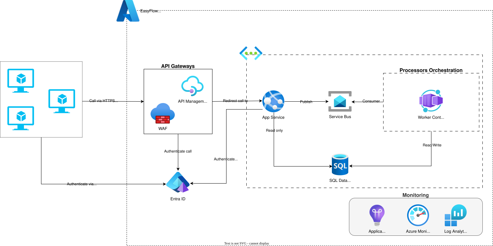
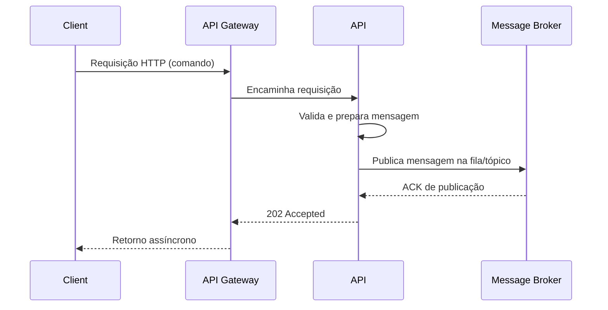
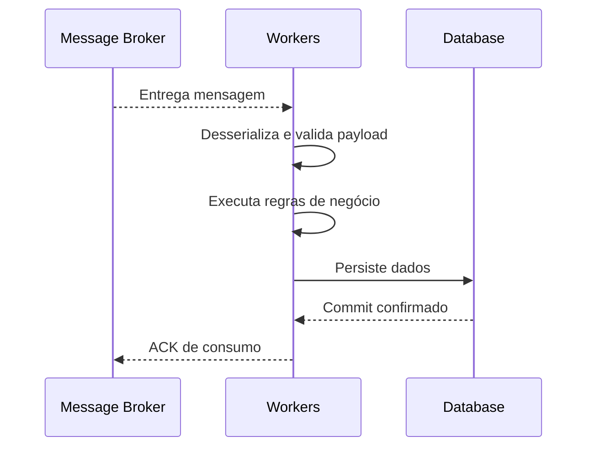

# 🎯 EasyFlow

> Desafio Arquiteto de Software

## Descrição do Projeto

Projeto desenvolvido para o desafio de Arquiteto de Software, com o objetivo de criar uma aplicação que gerencie fluxos de caixa de forma eficiente e escalável. O projeto é estruturado em camadas, seguindo os princípios de Clean Architecture, e utiliza tecnologias modernas para garantir a qualidade e a performance da aplicação.

## Arquitetura

Este projeto demonstra as características principais de uma arquitetura focada em alta demanda de requisições, processamento assíncrono, com foco em modularidade, escalabilidade e manutenção. A aplicação é dividida em camadas distintas, cada uma com responsabilidades claras, facilitando a evolução e a adaptação do sistema ao longo do tempo. O projeto tem como base o provedor de nuvem `Azure`, mas é projetado para ser agnóstico em relação ao ambiente de implantação, permitindo flexibilidade na escolha da infraestrutura.

- Escalabilidade:
  - Horizontal: Capacidade de adicionar mais instâncias da aplicação para lidar com aumento de carga. A API e Workers tem controle de escalabilidade de forma independente, permitindo otimizar recursos conforme a demanda.
- Resiliência:
  - Implementação de mecanismos de retry e circuit breaker para lidar com falhas temporárias em serviços externos, como o banco de dados ou o ServiceBus e RabbitMQ.¹
- Manutenibilidade:
  - Adoção de Clean Architecture para separar as responsabilidades em camadas, facilitando a manutenção e evolução do código. Domain como o `core` do sistema, isolando as regras de negócio, `Application` para orquestração de casos de uso, `Infrastructure` para as implementações dos serviços e componentes, além das declarações de D.I., `API` para exposição dos endpoints (Inbound) e `Worker` para processamento assíncrono (Outbound).
- Testabilidade:
  - Com a proposta de uma arquitetura clean, é possível realizar testes unitários nas "camadas" de `Domain` e `Application`, garantindo a confiabilidade das regras de negócio e casos de uso, e garantir teste de integração na `API` e `Worker` para validar via teste E2E.
- Segurança:
  - Utilização de `Keycloak` ou o `Microsoft Entra` para gerenciamento de identidade e acesso, garantindo a autenticação e autorização robustas para os usuários e aplicações.²
- Integridade dos Dados:
  - Uso de transações e controle de concorrência para garantir a integridade dos dados, especialmente em operações críticas como processamento de fluxos de caixa.
- Observabilidade:
  - Com a stack Grafana podemos ter uma conjunto de ferramentas de log, trace e métricas dos serviços, e o no caso da Azure (produção) temos o Application Insights, Azure Monitor e Log Analytics com dashboards usando o Grafana para analises de desempenho, disponibilidade e confiabilidade dos serviços.³
  - Open Telemetry Protocol (OTLP) para padronização e coleta de dados de observabilidade, facilitando a integração com diversas ferramentas de monitoramento.⁴



¹ - Para o retry, podemos utilizar bibliotecas como Polly, que oferece uma variedade de políticas de resiliência, incluindo retry, circuit breaker, timeout e fallback.

² - Pode ser utilizado o Grafana Cloud ou o Grafana LGTM para testes locais.

³ - Não foi implementado no projeto, mas é uma prática recomendada para garantir a observabilidade consistente em ambientes de produção.

⁴ - Não foi implementado no projeto, mas é uma prática recomendada para garantir a padronização com ferramentas de monitoramento.

### Processamento Assíncrono

Com a escolha de uma arquitetura de processamento assíncrono, a solução pode lidar com um grande volume de requisições sem sobrecarregar os recursos do sistema. A API é responsável por receber as requisições, validar os dados e publicar mensagens em um broker (como RabbitMQ ou ServiceBus), enquanto os Workers consomem essas mensagens, processam as regras de negócio e persistem os dados no banco de dados. Além do controle de processamento, podemos aplicar estratégias de controle de falhas, utilizando por exemplo a dead letter queue (DLQ) para mensagens que não puderam ser processadas, garantindo a confiabilidade do sistema, um número ínfimo de mensagens perdidas e a análise posterior dos erros.

Fluxo 1: Processamento inbound e publicação no broker.



Fluxo 2: Consumo da mensagem e persistência.



## Tecnologias Utilizadas

- Linguagem e plataforma
  - C#: linguagem principal utilizada para implementação da aplicação.
    - Referência: <https://learn.microsoft.com/dotnet/csharp/>
  - .NET 10 (net10.0): plataforma base para execução da API, Worker e bibliotecas.
    - Referência: <https://dotnet.microsoft.com/>

- Backend
  - ASP.NET Core (Web API): framework para exposição dos endpoints HTTP e pipeline da API.
    - Referência: <https://learn.microsoft.com/aspnet/core/>
  - .NET Worker Service: modelo para processamento assíncrono e jobs em background.
    - Referência: <https://learn.microsoft.com/dotnet/core/extensions/workers>

- Arquitetura e organização
  - Clean Architecture: separação em camadas para reduzir acoplamento e facilitar manutenção.
    - Referência: <https://learn.microsoft.com/dotnet/architecture/modern-web-apps-azure/common-web-application-architectures>
  - Padrão CQRS (camada de aplicação): separação de comandos e consultas para organizar regras de negócio.
    - Referência: <https://learn.microsoft.com/azure/architecture/patterns/cqrs>

- Persistência e dados
  - Entity Framework Core 10: ORM utilizado para mapeamento e acesso aos dados.
    - Referência: <https://learn.microsoft.com/ef/core/>
  - SQL Server (mcr.microsoft.com/mssql/server:2022-latest): banco de dados relacional principal da aplicação.
    - Referência: <https://learn.microsoft.com/sql/sql-server/>

- Mensageria
  - RabbitMQ (rabbitmq:4.0.9-management): broker para comunicação assíncrona entre componentes.
    - Referência: <https://www.rabbitmq.com/>
  - RabbitMQ.Client: biblioteca .NET para publicação e consumo de mensagens no RabbitMQ.
    - Referência: <https://www.nuget.org/packages/RabbitMQ.Client>

- Validação e resultados
  - FluentValidation: validação declarativa de objetos e comandos da aplicação.
    - Referência: <https://docs.fluentvalidation.net/>
  - FluentValidation.DependencyInjectionExtensions: integração do FluentValidation com o container de DI do .NET.
    - Referência: <https://www.nuget.org/packages/FluentValidation.DependencyInjectionExtensions>
  - FluentResults: padronização de retorno de sucesso/falha sem uso excessivo de exceções.
    - Referência: <https://github.com/altmann/FluentResults>

- Documentação e contratos de API
  - OpenAPI (Microsoft.AspNetCore.OpenApi): geração de contrato e documentação dos endpoints da API.
    - Referência: <https://learn.microsoft.com/aspnet/core/fundamentals/openapi/overview>
  - Scalar (Scalar.AspNetCore): interface para visualização e exploração da documentação OpenAPI.
    - Referência: <https://github.com/scalar/scalar>

- Identidade e acesso
  - Keycloak (quay.io/keycloak/keycloak): servidor de identidade para autenticação e autorização.
    - Referência: <https://www.keycloak.org/>
  - PostgreSQL 18 (postgres:18-alpine) para o Keycloak: banco utilizado pelo provedor de identidade.
    - Referência: <https://www.postgresql.org/docs/>

- Contêineres e orquestração local
  - Docker: empacotamento da aplicação e dependências em contêineres.
    - Referência: <https://docs.docker.com/>
  - Docker Compose: orquestração local dos serviços da solução (API, banco, mensageria e identidade).
    - Referência: <https://docs.docker.com/compose/>

- Testes
  - xUnit: framework de testes unitários utilizado no projeto.
    - Referência: <https://xunit.net/>
  - xUnit Runner (Visual Studio): adaptador para descoberta e execução de testes no ambiente .NET.
    - Referência: <https://www.nuget.org/packages/xunit.runner.visualstudio>
  - Microsoft.NET.Test.Sdk: infraestrutura de execução de testes para projetos .NET.
    - Referência: <https://www.nuget.org/packages/Microsoft.NET.Test.Sdk>
  - Coverlet (coverlet.collector): coletor de cobertura de código para execução de testes.
    - Referência: <https://github.com/coverlet-coverage/coverlet>

## Configuração do Ambiente

Passo a passo simples para executar o projeto localmente.

### 1. Preparar os containers do ambiente

Na raiz do repositório, suba os serviços de infraestrutura (identidade, banco e mensageria):

Observação: neste repositório o arquivo está nomeado como `compose.environment.yaml`.

```powershell
docker compose -f compose.environment.yaml up -d
```

Para validar se os containers estão ativos:

```powershell
docker compose -f compose.environment.yaml ps
```

### 2. Aplicar as migrações no banco de dados

No projeto de infraestrutura, execute:

```powershell
cd Src/Challenger.EasyFlow.Infrastructure
dotnet ef database update --connection <CONNECTION_STRING>
```

### 3. Executar a API

Em um terminal, na raiz do repositório:

```powershell
dotnet run --project Src/Challenger.EasyFlow.API
```

### 4. Executar os Workers

Em outro terminal, na raiz do repositório:

```powershell
dotnet run --project Src/Challenger.EasyFlow.Workers
```

### 5. Encerrar os containers

Quando finalizar os testes locais:

```powershell
docker compose -f compose.environment.yaml down
```
