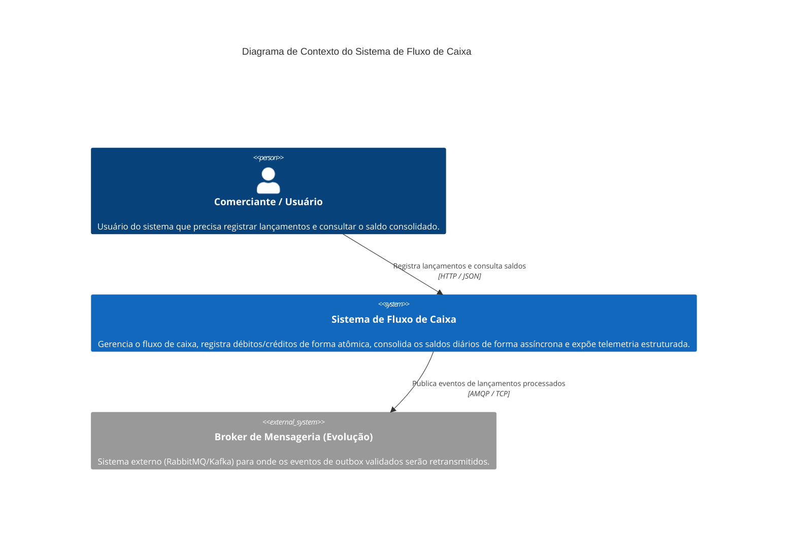
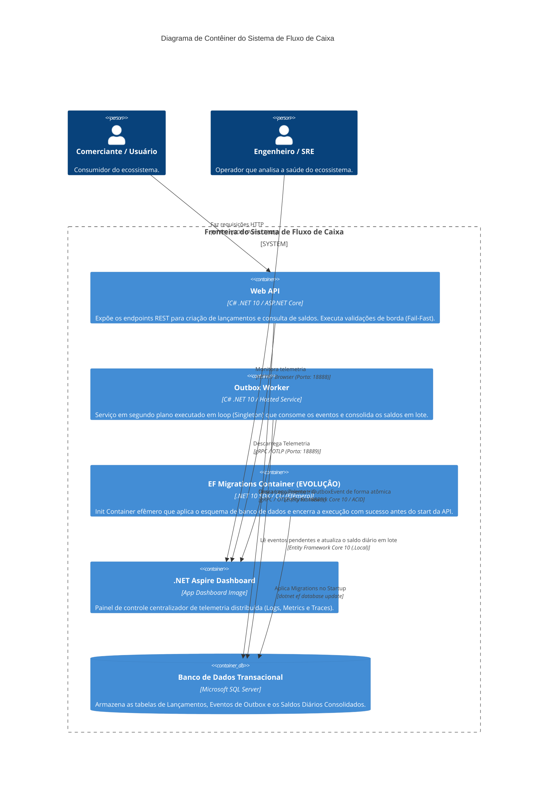
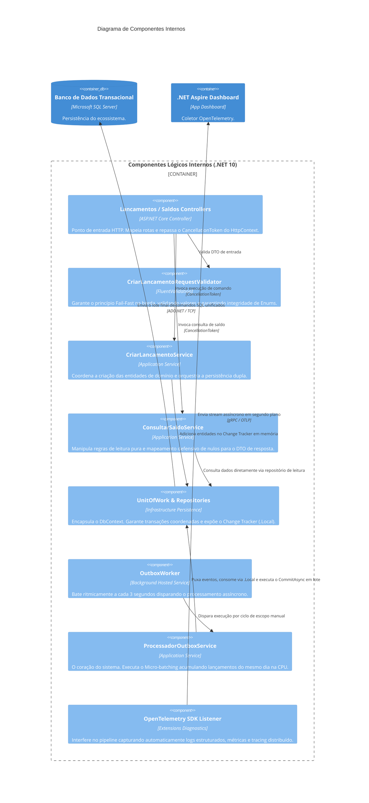
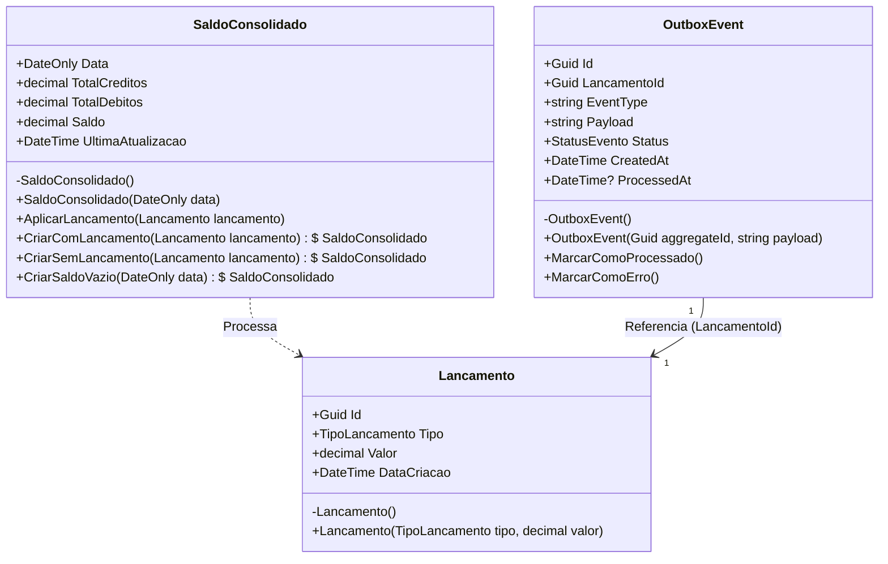

# 🗺️ Visão Estrutural (Diagramas) - Modelo C4

Este documento descreve a arquitetura do sistema utilizando o **Modelo C4**, permitindo visualizar a solução desde o contexto de negócio até a decomposição interna e o design do código.

---

## 🛑 Nível 1: Diagrama de Contexto (System Context)
Mostra o escopo do sistema, como ele se posiciona no ecossistema de negócio e como os atores e sistemas externos interagem com ele.

---

## 📦 Nível 2: Diagrama de Contêiner (Container Diagram)
Mostra a arquitetura de alto nível do sistema, dividida em contêineres executáveis (aplicações, APIs, bancos de dados) e as tecnologias utilizadas.

---

## 🧱 Nível 3: Diagrama de Componente (Component Diagram)
Decompõe o contêiner da aplicação para mostrar os componentes lógicos internos e como as interfaces e padrões de projeto (Design Patterns) estão acoplados.

---

## 💻 Nível 4: Diagrama de Código (Code Diagram)
Detalha a modelagem de classes, o encapsulamento estrito das invariantes e as propriedades do **Rich Domain Model** (Domínio Rico) desenvolvidas na camada de Core/Domain.

