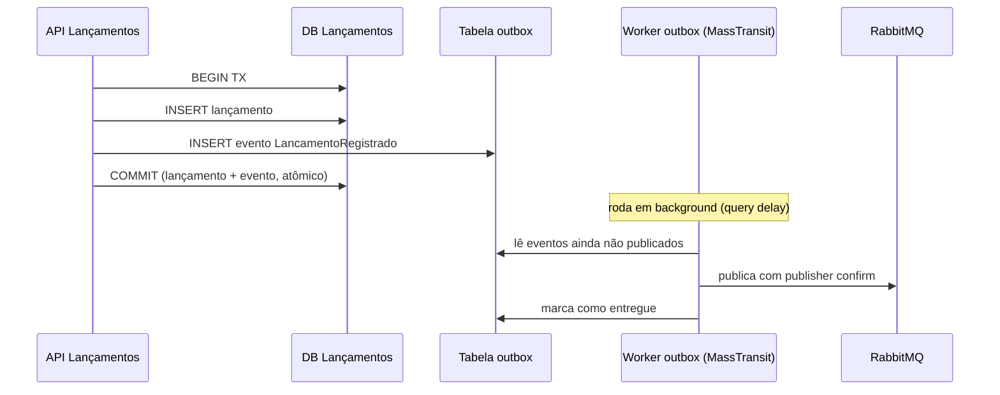

# ADR 0003 — Transactional Outbox

Status: aceito

## Contexto
Ao registrar um lançamento preciso fazer duas coisas: gravar no banco e
publicar o evento `LancamentoRegistrado`. Se forem duas operações
independentes, há uma janela de inconsistência — o famoso *dual-write problem*:

- grava no banco e o processo morre antes de publicar → evento perdido, saldo
  nunca atualiza;
- publica e a transação do banco faz rollback → evento de um lançamento que não
  existe.

Nenhum dos dois é aceitável para um saldo financeiro.

## Decisão
Usar o **Transactional Outbox**. O evento é gravado numa tabela de outbox na
**mesma transação** do lançamento. Um processo separado lê a outbox e publica
no broker, marcando como entregue. Como gravação do lançamento e gravação do
evento compartilham a transação, ou as duas acontecem ou nenhuma acontece.

Na prática uso o **outbox nativo do MassTransit com EF Core**
(`AddEntityFrameworkOutbox` + `UseBusOutbox`), em vez de escrever o padrão na
mão.

## Fluxo

## Consequências
- Atomicidade entre persistir o lançamento e registrar o evento. Sem evento
  fantasma, sem evento perdido.
- A entrega ao broker passa a ser **at-least-once** (o publisher pode reentregar
  se cair depois de publicar e antes de marcar como entregue). Isso é tratado
  no ADR 0004 (idempotência no consumidor).
- Pequena latência adicional na publicação (o delivery roda em background com um
  *query delay*). Irrelevante para o caso de uso.
- Acoplamento ao MassTransit para a infraestrutura de mensageria — aceito, é a
  biblioteca padrão do ecossistema .NET para isso.
