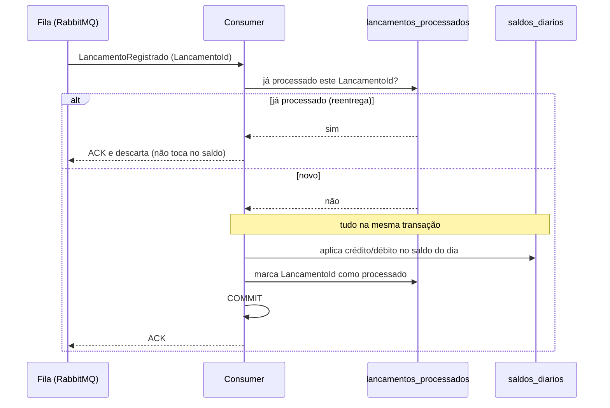

# ADR 0004 — Consumidor idempotente

Status: aceito

## Contexto
Com outbox (ADR 0003) e a entrega *at-least-once* do RabbitMQ, a mesma mensagem
pode chegar ao consolidado mais de uma vez — por redelivery após falha, por
reentrega do publisher, por reconexão. Se o consumidor simplesmente somasse o
valor toda vez, uma reentrega dobraria o saldo do dia. Inaceitável.

## Decisão
Tornar o consumidor **idempotente**, usando o `LancamentoId` como chave de
idempotência. Antes de aplicar um lançamento à projeção, o caso de uso checa
uma tabela `lancamentos_processados`; se o id já está lá, descarta a mensagem
sem tocar no saldo. A marcação do id e a atualização do saldo acontecem na
**mesma transação**, então não há estado intermediário inconsistente.

Uma única camada, na chave de negócio. Cheguei a também usar o inbox do
MassTransit (dedupe por `MessageId` no transporte), mas **removi**: era redundante
com a chave de negócio — que é mais forte, porque protege contra qualquer caminho
que gere o mesmo lançamento, não só contra a reentrega do mesmo envio — e o inbox
ainda adicionava uma transação por mensagem que derrubava a vazão do consumidor.
Menos peças, mesma garantia.

Como a projeção é uma linha por dia, o consumo é serializado
(`ConcurrentMessageLimit = 1`) para evitar corrida de escrita na mesma linha.
Mensagens que falham de verdade têm retry com backoff e, esgotadas as tentativas,
vão para a *error queue* (DLQ) do MassTransit, sem travar a fila.

## Fluxo

## Consequências
- Reprocessar o mesmo evento é seguro: o saldo não dobra. (Há teste de
  integração cobrindo exatamente isso.)
- A idempotência por chave de negócio nos deixa independentes de detalhes do
  broker — se um dia trocar o transporte, a garantia continua valendo.
- Custo de um lookup + uma linha por lançamento processado. Barato e a tabela é
  podável por data se necessário.
