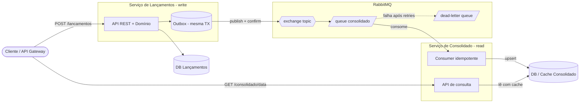

# Visão geral da arquitetura

O sistema resolve um problema simples de domínio — registrar lançamentos
(débito/crédito) e consultar o saldo diário consolidado — mas com uma
restrição que dita todo o desenho: **o serviço de lançamentos não pode cair
junto com o consolidado**.

Por isso optei por dois serviços independentes, comunicação assíncrona e
separação entre o modelo de escrita e o de leitura (CQRS). Se o consolidado
ficar fora do ar, os eventos se acumulam na fila e o lançamento segue
funcionando normalmente; quando o consolidado volta, ele processa o backlog.

## Componentes

- **Serviço de Lançamentos (write side)** — recebe os lançamentos, é a fonte
  da verdade. Grava no seu próprio banco e, na mesma transação, registra o
  evento numa tabela de _outbox_.
- **Serviço de Consolidado (read side)** — consome os eventos de lançamento e
  mantém uma projeção do saldo por dia, otimizada para leitura.
- **RabbitMQ** — desacopla os dois lados. Exchange do tipo _topic_ para
  permitir que novos consumidores assinem os eventos no futuro sem alterar o
  produtor.

## Fluxo

## Por que cada decisão

| Decisão | Motivo |
|---|---|
| Dois serviços separados | Atende o RNF de disponibilidade independente com o mínimo de complexidade |
| Comunicação assíncrona (RabbitMQ) | Lançamento não tem dependência síncrona do consolidado |
| Bancos separados | Falha de um não derruba o outro; cada lado escala isolado |
| CQRS | Escrita transacional de um lado, leitura otimizada/cacheável do outro |
| Transactional Outbox | Evita o _dual-write problem_: grava lançamento e evento atomicamente |
| Consumidor idempotente | Entrega _at-least-once_ do broker não pode dobrar o saldo |
| DLQ + retry com backoff | Mensagem problemática não trava a fila principal |

## Como os requisitos não-funcionais são atendidos

- **"Lançamento não cai se o consolidado cair"** — não há chamada síncrona
  entre os serviços; a fila bufferiza enquanto o consolidado estiver fora.
- **"50 req/s no consolidado, até 5% de perda"** — leitura sobre o read model
  com cache e consumidor escalável horizontalmente. A folga de 5% permite
  trabalhar com consistência eventual sem prejuízo para o negócio.
