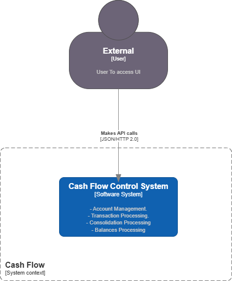
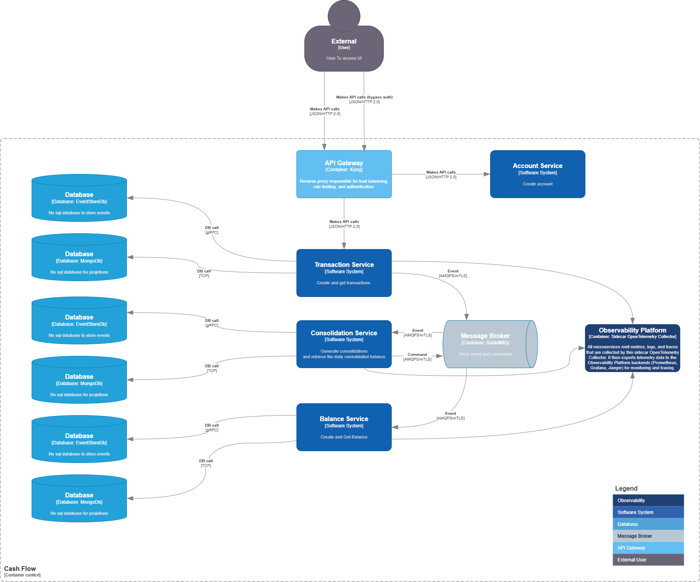

# 📊 Cash Flow Control System

## Overview
This project implements a **cash flow control system** designed to help merchants manage their daily transactions and consolidated balances.  
The architecture follows modern principles of **event-driven design (EDA)**, **CQRS + Event Sourcing**, and microservices, providing scalability, resilience, and flexibility.  
It is fully containerized using Docker Compose, making it easy to set up and run locally or deploy to the cloud.

The system enables:
- Creating accounts
- Recording debit and credit transactions
- Generating and retrieving daily consolidated balances
- Querying current balances

All operations are designed to be **idempotent**, **deterministic**, and fault-tolerant. Authentication is handled externally by the API Gateway.

---

---

## 🏛️ Architecture Decisions

For detailed rationale, alternatives considered, and trade-offs behind key architectural choices — including microservices, RabbitMQ messaging, event sourcing, API Gateway, containerization, and observability — please refer to the [Architecture Decision Records (ADRs)](./Docs/ADR/ADR-001.md).


## 🧩 Architecture
- **Pattern:** Event-Driven Architecture (EDA) with **CQRS** and **Event Sourcing**
- **Microservices:**
  - `AccountService`: Manages account creation and issues tokens.
  - `TransactionService`: Records debit/credit transactions.
  - `ConsolidationService`: Generates daily consolidations based on transactions.
  - `BalanceService`: Computes and provides the current balance.
- **Saga Pattern:**
  - Uses Choreography-based Saga to manage distributed transactions across microservices, ensuring failure handling and rollback without a centralized orchestrator.
- **API Gateway:**
  - Built with **Kong**, acts as a reverse proxy and enforces authentication.
- **Message Broker:**
  - RabbitMQ for reliable asynchronous event delivery between services, using **mutual TLS (mTLS)** for secure communication.
  - Implements the **Dead Letter Pattern** to handle undeliverable or failed messages gracefully.
- **Datastores:**
  - `EventStoreDB`: Stores all events in an append-only log (via gRPC).
  - `MongoDB`: Stores projections (read models) for fast queries:
    - Transactions by AccountId & Date
    - Consolidations by AccountId & Date
    - Balance by AccountId
- **Bounded Contexts:**
  - Each microservice represents a **bounded context**, fully owning its data and logic.
- **Containerization & Orchestration:**
  - Each microservice runs inside its own Docker container.
  - Containers are orchestrated by Kubernetes, enabling horizontal and vertical scaling based on demand, ensuring high availability and efficient resource utilization.

The system ensures that **Transaction Service remains operational even if Consolidation Service becomes unavailable**, supporting the business requirement of service independence.

---

## 📊 Observability & Monitoring (Cost-Effective Open Source Stack)
For observability and monitoring, the following open-source tools are recommended:

- **Sidecar:** OpenTelemetry (for metrics, traces, and logs instrumentation)
- **Metrics Backend:** Prometheus + Grafana (for scraping, storing, and visualizing metrics)
- **Distributed Tracing:** Jaeger (for tracing request flows across services)
- **Logging:** Elasticsearch acts as the storage and search engine where logs and other telemetry data are indexed and stored. Kibana is the visualization and dashboard tool that connects to Elasticsearch to display, explore, and analyze those logs and telemetry data.

---

## 🛠️ Patterns & Practices
✅ Event Sourcing  
✅ CQRS (Command Query Responsibility Segregation)  
✅ Event-Driven Communication (RabbitMQ)  
✅ Dead Letter Pattern for failed events  
✅ Minimal APIs (lightweight .NET services)  
✅ Idempotent command handling with deterministic `streamId` control  
✅ Disposable resources  
✅ mTLS between services through the broker  
✅ Docker Compose orchestration  
✅ Only **open source** technologies were used, optimizing for low infrastructure and licensing costs.

---

## 💻 Technology Choices
- **.NET 8 (LTS):** Ensures long-term support, stability, and modern runtime performance.
- **EventStoreDB:** Native event sourcing database with gRPC.
- **MongoDB:** Document-based store for projections, high read performance.
- **RabbitMQ:** Proven message broker with support for mTLS and dead-letter queues.
- **Kong Gateway:** Cloud-native API gateway with authentication and rate-limiting.
- **Docker Compose:** Orchestration of all services for easy deployment and local development.

---

## 🚀 Running the project

### Prerequisites
- Docker & Docker Compose installed

### Clone repository
```bash
git clone https://github.com/andreymmonteiro/CashFlow.git
```

### Navigate to the project folder
```bash
cd CashFlow
```

### Create Network
```bash
docker network create cashflow-net
```

### Run locally
```bash
docker compose up -d
```

### Account Service

- HTTPS: https://localhost:7071/Swagger
- HTTP: http://localhost:5020/Swagger

### Transaction Service

- HTTPS: https://localhost:7203/Swagger
- HTTP: http://localhost:5106/Swagger

### Consolidation Service

- HTTPS: https://localhost:7061/Swagger
- HTTP: http://localhost:5010/Swagger

### Balance Service

- HTTPS: https://localhost:7219/Swagger
- HTTP: http://localhost:5070/Swagger

## Non-Functional Testing

### Navigate to the load test folder

```bash
cd Tests\NonFunctional.Tests.Load
```
### Run

```bash
docker compose up
```

### System Context



### Container Context

