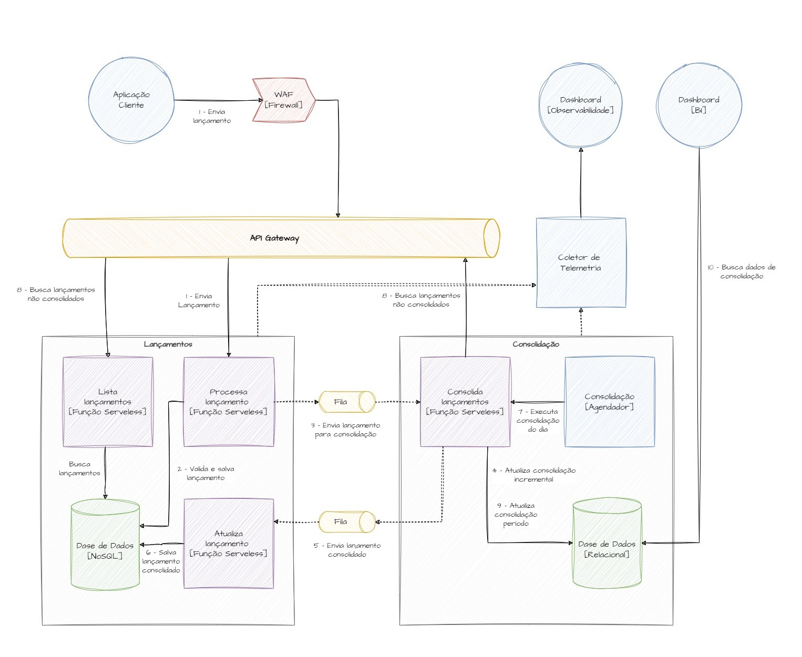

### ADR-001: Adoção de Arquitetura Serverless para Sistema de Controle de Fluxo de Caixa

## Status

Em avaliação - Aguardando entrevista técnica com o cliente

## Contexto

O comerciante necessita de um sistema para controlar seu fluxo de caixa diário com os seguintes requisitos:

Controle de lançamentos (débitos e créditos)
Relatórios de saldo diário consolidado
Alta disponibilidade (serviço de lançamentos não pode ficar indisponível)
Capacidade de processar picos de 50 req/s com máximo 5% de perda
Solução cost-effective para pequenos e médios comerciantes

## Problema

Precisamos definir a arquitetura de software que melhor atenda aos requisitos de:

Escalabilidade: Lidar com variações de tráfego (1 req/s a 50+ req/s)
Disponibilidade: Garantir que lançamentos sempre sejam processados
Custo: Solução economicamente viável para PMEs
Manutenibilidade: Baixa complexidade operacional
Time-to-market: Desenvolvimento e deploy rápidos

## Solução: Arquitetura Serverless (Escolhida)

#### Componentes:

API Gateway (Opcional, mas recomendado para simplicidade da integração entre os serviços)
Função Serveless
Banco de dados NoSQL
Banco de dados Relacional
Fila

#### Prós:

Custo baseado em uso
Escalabilidade automática
Zero administração de servidores
Alta disponibilidade nativa
Integração natural entre componentes

#### Contras:

Cold starts ocasionais
Limites de timeout (15 minutos)

## Decisão

Escolhido a Arquitetura Serverless baseada no seguinte critério: Custo-Efetividade

### Escolha do Banco de Dados NoSQL para o Serviço de Lançamentos

Para o serviço de lançamentos, foi escolhido um banco de dados NoSQL pelas seguintes características:

#### Características do Domínio de Lançamentos:

**Writes Intensivos**: O serviço possui uma característica de inserção constante de novos lançamentos, sem necessidade de atualizações frequentes após criação

**Reads Simples**: As consultas são diretas - busca por ID do lançamento, comerciante, ou período específico

**Sem Relacionamentos**: Cada lançamento é uma entidade independente, sem necessidade de joins ou relacionamentos complexos

**Estrutura Simples**: Os documentos são flat (planos), com poucos níveis de aninhamento, facilitando a modelagem

**Simplicidade Operacional**: Não requer tuning complexo de queries, otimização de índices ou manutenção elaborada

### Escolha do Banco de Dados Relacional para o Serviço de Consolidado

Para o serviço de consolidado, foi escolhido um banco de dados relacional pelas seguintes vantagens:

#### Vantagens:

**Consistência de Dados**: Garantia de ACID (Atomicidade, Consistência, Isolamento, Durabilidade) para operações críticas de cálculo de saldo

**Consultas Complexas**: Suporte nativo a SQL para agregações, joins e análises financeiras complexas

**Transações**: Garantia de integridade durante operações de consolidação

**Auditoria e Compliance**: Facilidade para implementar trilhas de auditoria e controles de conformidade financeira

### Fluxo e Integração Entre os Serviços

O fluxo e integração entre os serviços de lançamento e consolidação foi pensado da seguinte forma:

#### Processamento Incremental (Tempo Real):

1. **Aplicação cliente envia um pedido de lançamento**
2. **Função de processamento de lançamentos recebe o pedido, valida e salva na base de dados**
3. **Função de processamento envia de forma assíncrona o lançamento para consolidação incremental**
4. **Função de consolidação recebe o pedido, valida e atualiza o consolidado**
5. **Função de consolidação envia de forma assíncrona para atualização do lançamento, informando que o mesmo foi consolidado**
6. **Função de atualização de lançamento atualiza**

#### Limitações do Processamento Incremental:

O processamento incremental não é 100% confiável por várias razões:

- **Nas etapas 2 e 3**: O lançamento é salvo, mas a fila pode falhar
- **Na etapa 4**: O banco pode estar indisponível ou apresentar falhas
- **Objetivo**: Dados quase em tempo real para os dashboards

#### Processamento Batch (Garantia de Consistência):

Dessa forma, foi criado um agendador, que garante a consistência:

7. **No final do dia, o agendador executa a consolidação dos lançamentos**
8. **A função de consolidação busca todos os lançamentos que não foram consolidados durante o dia**
9. **A função de consolidação atualiza o consolidado e salva na base**
10. **Os dados são disponíveis para relatórios**

### Estratégias de Resiliência

A arquitetura serverless escolhida incorpora as seguintes estratégias de resiliência:

#### Funções Serverless:

**Retry Automático**: Configuração de tentativas automáticas em caso de falhas temporárias

**Dead Letter Queues (DLQ)**: Redirecionamento de mensagens com falha para análise posterior

**Circuit Breaker Pattern**: Prevenção de cascata de falhas através de interrupção de chamadas com alta taxa de erro

**Timeout Configurável**: Definição de timeouts adequados para evitar execuções indefinidas

**Versionamento**: Capacidade de rollback rápido para versões anteriores em caso de problemas

**Isolamento de Recursos**: Separação de funções por responsabilidade para limitar impacto de falhas
